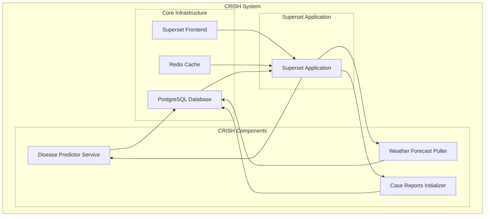

# CRISH: Climate Risk Information System for Public Health

CRISH is a comprehensive Health Decision Support System (DSS) built on top of the Apache Superset platform. It enhances Superset with specialized health analytics capabilities, disease prediction models, and additional components tailored for health data management and analysis.

## System Architecture

CRISH extends Apache Superset's data visualization and analytics platform with custom components specifically designed for health data management, disease prediction, and decision support. The architecture consists of several interconnected components:

### Core Components

1. **Apache Superset Base**
   - The foundation of CRISH, providing data visualization, dashboarding, and SQL lab capabilities
   - Extended with custom views, models, and components for health data management
   - Includes a modified UI with CRISH branding and health-specific customizations

2. **Disease Predictor Service**
   - Containerized machine learning service for disease prediction
   - Uses LSTM neural network models to predict disease cases based on weather data and historical case reports
   - Currently supports diarrhea prediction with municipality-specific models
   - Generates weekly predictions with confidence intervals

3. **Weather Forecast Puller Service**
   - Retrieves weather forecast data from external data sources
   - Processes and transforms raw weather data for use in prediction models
   - Stores historical and forecast weather data for analysis
   - Supports parameters like temperature, rainfall, humidity, and wind speed

4. **Case Reports Initializer**
   - Processes and imports historical disease case reports
   - Normalizes data from different administrative regions
   - Supports various disease types (Dengue, ARI/ISPA, Diarrhea)
   - Maps data to standardized municipality codes

5. **Health Facilities Management**
   - Custom data model for health facility information
   - Tracks facility details including location, capacity, services, and resources
   - Supports geographic visualization and proximity analysis
   - Includes administrative metadata and operational information

### Architectural Approach

This architecture follows a microservices pattern where the main Superset application serves as the central integration point. The specialized CRISH services (disease prediction, weather forecasting, case reporting) operate as independent containers but are initiated, managed, and coordinated through the Superset application, which provides the user interface, API endpoints, and central database access.

### Data Flow

1. Weather data is pulled regularly from external sources by the Weather Forecast Puller
2. Historical disease case data is imported through the Case Reports Initializer
3. The Disease Predictor combines weather data and historical case reports to generate predictions
4. Prediction results are stored in the database and made available through Superset dashboards
5. Health facility data is managed through a custom interface and visualized on maps

### Database Schema

The system uses a PostgreSQL database with extensions for geographic data. Key tables include:

- `health_facilities`: Stores health facility information
- `tlhis_diseases`: Stores disease case reports with details like municipality, date, disease type, and case counts
- Weather data tables for storing historical and forecast weather information
- Standard Superset tables for dashboards, charts, and user management

## Deployment Architecture

CRISH is deployed using Docker containers orchestrated with Docker Compose:

### Diagram Explanation

The directional arrows (`-->`) in the diagram represent data flow and functional relationships between components:

- **Frontend to Application**: UI requests flow from Superset Frontend to the Application layer
- **Cache and Database to Application**: Redis provides cached data and PostgreSQL provides stored data to the Application
- **Application to CRISH Components**: The Superset Application initiates and manages the specialized CRISH services
- **CRISH Components to Database**: Each component writes processed data back to the central PostgreSQL database:
  - Disease Predictor writes prediction results
  - Weather Forecast Puller stores retrieved weather data
  - Case Reports Initializer writes imported case data

## Technologies Used

- **Backend**: Python, Flask, SQLAlchemy
- **Database**: PostgreSQL with GIS extensions
- **Data Processing**: Pandas, NumPy
- **Machine Learning**: TensorFlow, Keras, Joblib
- **Containerization**: Docker, Docker Compose
- **Visualization**: Apache Superset, React
- **Scheduling**: Celery, Redis

## Disease Prediction Models

CRISH includes machine learning models for predicting disease outbreaks:

- **Model Type**: LSTM (Long Short-Term Memory) neural networks
- **Input Features**: 
  - Weather data (temperature, precipitation, humidity)
  - Historical case reports
- **Output**: Predicted case counts with confidence intervals
- **Municipalities Covered**: Aileu, Atauro, Baucau, Bobonaro, Dili, Ermera, Liquica, Viqueque
- **Diseases Supported**: Currently focused on diarrhea prediction, with plans to extend to Dengue and ARI

## Getting Started

### Prerequisites

- Docker and Docker Compose
- Git
- Internet connection for pulling weather data

### Installation

1. Clone the CRISH repository
2. Configure environment variables in docker/.env
3. Run `docker-compose up`

### Configuration

The system can be configured through environment variables:
- Database connection parameters
- Weather data API credentials
- Prediction model parameters
- Scheduling options

## Future Roadmap

- Additional disease prediction models
- Enhanced visualization capabilities
- Mobile application integration
- Real-time alerting system
- Integration with additional data sources

## Contributing

See the CONTRIBUTING.md file for details on how to contribute to the CRISH project.

## License

This project is built on Apache Superset and follows its licensing terms. 