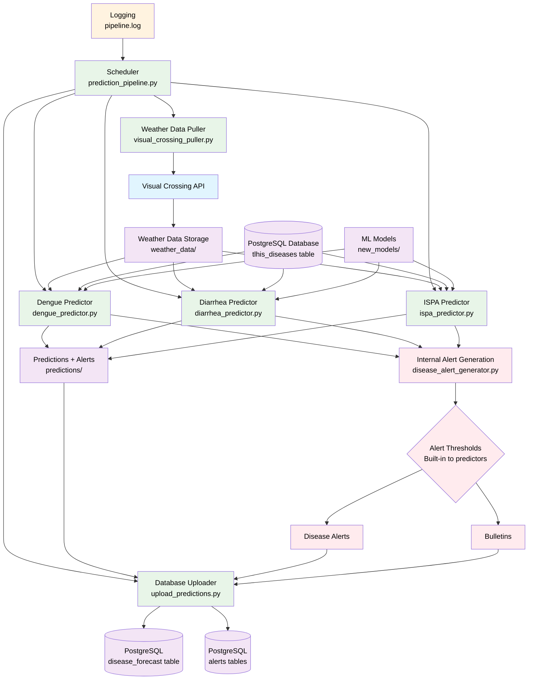
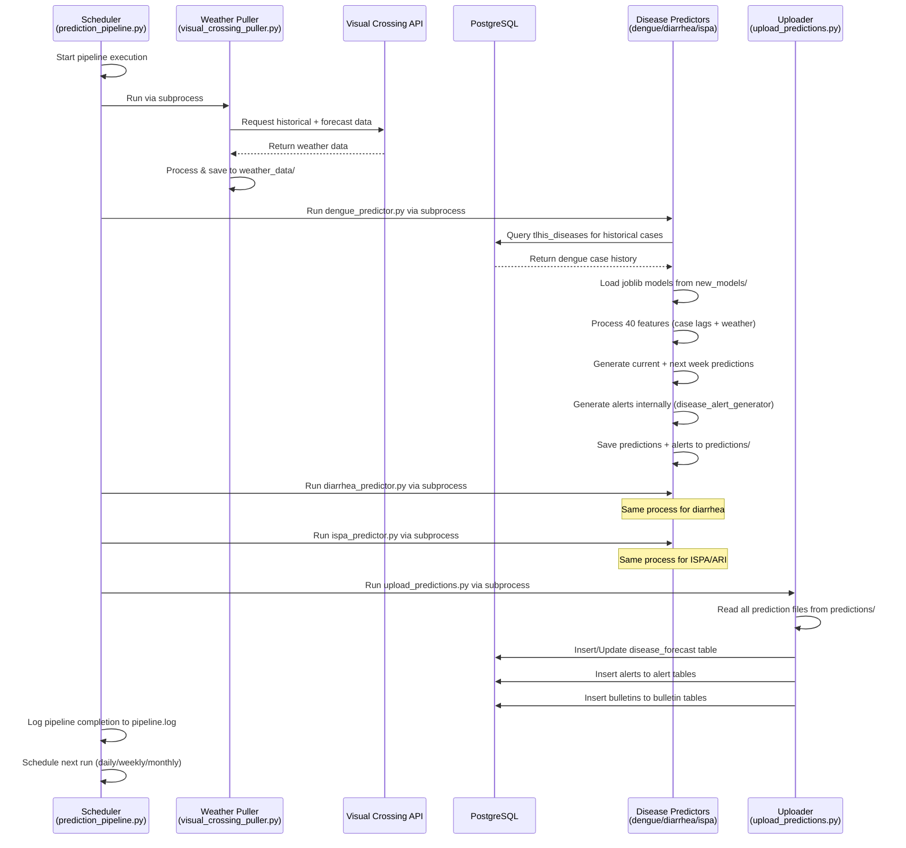

# Disease Prediction Pipeline

An automated pipeline for predicting dengue, diarrhea, and ISPA/ARI cases in Timor-Leste municipalities based on weather data and historical disease cases.

## Overview

This pipeline automates the following steps:
1. Pulls historical weather data and weather forecasts from Visual Crossing API
2. Predicts dengue cases for current week and next week using machine learning models
3. Predicts diarrhea cases for current week and next week using machine learning models
4. Predicts ISPA/ARI cases for current week and next week using machine learning models
5. Generates disease alerts based on configurable thresholds
6. Uploads predictions to a PostgreSQL database

## Pipeline Architecture



### Pipeline Data Flow



## Directory Structure

```
.
├── README.md
├── requirements.txt
├── .env
├── docker-compose.yml
├── Dockerfile
├── prediction_pipeline.py
├── visual_crossing_puller.py
├── dengue_predictor.py
├── diarrhea_predictor.py
├── ispa_predictor.py
├── disease_alert_generator.py
├── upload_predictions.py
├── new_models/                          # Current ML models (joblib format)
│   ├── Dengue/
│   │   └── {municipality}_Dengue.joblib
│   ├── Diarrhea/
│   │   └── {municipality}_Diarrhea.joblib
│   └── ISPA/
│       └── {municipality}_ISPA.joblib
├── dengueModels/                        # Legacy models (.h5 and .pkl format)
│   ├── {municipality}.h5
│   └── {municipality}_minmax_scaler.pkl
├── diarrheaModels/                      # Legacy models (.h5 and .pkl format)
│   ├── {municipality}.h5
│   └── {municipality}_minmax_scaler.pkl
├── predictions/
│   ├── dengue_predictions_{date}.json
│   ├── diarrhea_predictions_{date}.json
│   └── ISPA_predictions_{date}.json
├── weather_data/
│   ├── all_municipalities_weekly_averages_{date}.json
│   ├── all_municipalities_forecast_{date}.json
│   ├── {municipality}_historical_{date}.json    # Individual historical data
│   └── {municipality}_forecast_{date}.json      # Individual forecast data
├── config/
│   └── timorleste.geojson               # Municipality boundaries
├── docs/
│   └── disease_forecast_thresholds.md   # Alert threshold configurations
├── tests/                               # Test files
│   ├── test_dengue_features.py
│   ├── test_ispa_features.py
│   ├── test_new_dengue_predictor.py
│   └── verify_feature_order.py
├── backups/                             # Backup files
└── pipeline.log                         # Runtime logs
```

## Configuration

The pipeline is configured through environment variables in the `.env` file:

```env
# Visual Crossing API Configuration
VISUAL_CROSSING_API_KEY=your_api_key

# Model Directories
NEW_MODELS_DIR=new_models/Dengue
NEW_DIARRHEA_MODELS_DIR=new_models/Diarrhea
NEW_ISPA_MODELS_DIR=new_models/ISPA
# Legacy model directories (older .h5 and .pkl models)
DENGUE_MODELS_DIR=dengueModels
DIARRHEA_MODELS_DIR=diarrheaModels

# Database Configuration
DATABASE_DB=superset
DATABASE_HOST=db  # For Docker deployment (or external IP for standalone)
DATABASE_PORT=5432  # Default PostgreSQL port (or custom port like 24432)
DATABASE_PASSWORD=superset
DATABASE_USER=superset

# Output Directories
PREDICTIONS_DIR=predictions
WEATHER_DATA_DIR=weather_data

# Default values for predictions
DEFAULT_PREV_CASES=1
MAX_WEEKS_HISTORY=4

# Disease Prediction Pipeline Configuration
DISEASE_PREDICTION_PIPELINE_FREQUENCY=weekly  # Options: daily, weekly, monthly
DISEASE_PREDICTION_PIPELINE_RUN_TIME=01:00   # 24-hour format
DISEASE_PREDICTION_PIPELINE_RUN_IMMEDIATE=false  # Whether to run pipeline immediately on startup

# MinIO/S3 Configuration (for bulletin attachments)
MINIO_ROOT_USER=minioadmin
MINIO_ROOT_PASSWORD=minioadmin
S3_BUCKET=crish-attachments
S3_ENDPOINT_URL=https://s3-api.crish.rimes.int
S3_ADDRESSING_STYLE=path
S3_PRESIGNED_URL_EXPIRATION=3600
S3_PUBLIC_ENDPOINT_URL=https://s3-api.crish.rimes.int
```

## Deployment Options

### Option 1: Standalone Deployment

#### Installation
1. Clone the repository
2. Install dependencies:
```bash
pip install -r requirements.txt
```
3. Configure the `.env` file with your settings
4. Ensure model files are present in their respective directories

#### Running Locally
Start the pipeline directly:
```bash
python prediction_pipeline.py
```

#### Docker Standalone Deployment
1. Configure your `.env` file with database connection details
2. Build and run using Docker Compose:
```bash
docker-compose up -d
```

The standalone Docker setup includes:
- **Container Name**: `disease-predictor`
- **Volumes**: 
  - Application code mounted at `/app`
  - TimorLeste GeoJSON configuration file
- **Environment**: Configurable via `.env` and optional `.env-local`
- **Restart Policy**: `unless-stopped`

#### Pipeline Configuration
The pipeline can be configured to run:
- Daily at a specific time
- Weekly on Mondays at a specific time
- Monthly on the 1st at a specific time

### Option 2: Integrated Deployment (CRISH Superset Stack)

The disease predictor is integrated into the larger CRISH system as part of the Superset stack.

#### Integration Setup
1. Navigate to the main superset directory: `/Users/ericksoncruz/Documents/RIMES/superset/`
2. The disease predictor runs automatically as part of the stack:
```bash
docker-compose up -d
```

#### Integrated Configuration
- **Container Name**: `superset_disease_predictor` 
- **Build Context**: `./crish-disease-predictor`
- **Dependencies**: PostgreSQL database (`db` service)
- **Shared Resources**:
  - Database connection with Superset
  - Shared environment configuration
  - TimorLeste GeoJSON configuration
- **Network**: Connected to the same Docker network as Superset services

#### Environment Variables
Environment variables are shared through:
- `docker/.env` (main configuration)
- `docker/.env-local` (optional local overrides)

Database connection automatically uses the Superset PostgreSQL instance:
- Host: `db` (Docker service name)
- Database: `superset`
- Credentials: Shared with Superset configuration

#### Service Dependencies
The disease predictor service depends on:
- **db**: PostgreSQL database service
- Automatically starts after database is ready
- Shares data storage with other CRISH modules

## Components

### 1. Weather Data Puller (`visual_crossing_puller.py`)
- Fetches historical weather data from Visual Crossing API
- Retrieves weather forecast data for the next week
- Calculates weekly averages for temperature, humidity, and precipitation
- Saves data to JSON files in the weather_data directory

### 2. Disease Predictors (`dengue_predictor.py`, `diarrhea_predictor.py`, `ispa_predictor.py`)
- Load machine learning models (joblib format) for each municipality
- Pull historical case data from the database using disease-specific queries
- Process weather data with 40-feature input structure (disease lags 1-4 + weather parameters)
- Make predictions for the current week and next week
- Generate disease alerts based on configurable thresholds
- Save predictions to JSON files in the predictions directory

### 3. Alert Generator (`disease_alert_generator.py`)
- Generates disease-specific alerts based on prediction thresholds
- Creates bulletins for moderate, high, and severe risk levels
- Integrates with the database to store alerts and bulletins
- Records pipeline run information for monitoring

### 4. Prediction Uploader (`upload_predictions.py`)
- Connects to PostgreSQL database
- Uploads predictions with proper municipality codes for both current and next week
- Handles data conflicts with UPSERT operations

### 5. Pipeline Orchestrator (`prediction_pipeline.py`)
- Schedules and coordinates all components
- Provides logging and error handling
- Manages the execution frequency
- Logs all activities to `pipeline.log`

## Database Schema

The predictions are stored in a table named `disease_forecast` with the following structure:
```sql
CREATE TABLE disease_forecast (
    year INTEGER CHECK (year >= 2000),
    week_number INTEGER CHECK (week_number BETWEEN 1 AND 53),
    disease VARCHAR(50) NOT NULL,
    municipality_code CHAR(5) NOT NULL,
    municipality_name VARCHAR(50) NOT NULL,
    predicted_cases INTEGER CHECK (predicted_cases >= 0),
    forecast_date TIMESTAMP,
    created_at TIMESTAMP DEFAULT CURRENT_TIMESTAMP,
    updated_at TIMESTAMP DEFAULT CURRENT_TIMESTAMP,
    PRIMARY KEY (year, week_number, disease, municipality_code)
);
```

The table includes:
- `year` and `week_number`: The ISO year and week number
- `disease`: Type of disease being predicted ('dengue', 'diarrhea', or 'ISPA')
- `municipality_code`: ISO code for the municipality
- `municipality_name`: Full name of the municipality
- `predicted_cases`: The predicted number of cases
- `forecast_date`: The Monday date of the prediction week (timestamp)
- `created_at`: When the prediction was first added to the database
- `updated_at`: When the prediction was last updated

### Additional Database Tables

The system also creates and maintains several supporting tables:

#### Disease Alerts Table
```sql
CREATE TABLE disease_forecast_alerts (
    id SERIAL PRIMARY KEY,
    municipality_code TEXT,
    forecast_date DATE, -- Stores week_start
    disease_type TEXT,
    alert_level TEXT,
    alert_title TEXT,
    alert_message TEXT,
    predicted_cases INTEGER,
    municipality_name TEXT,
    UNIQUE (municipality_code, forecast_date, disease_type, municipality_name)
);
```

#### Bulletin Attachments Table
```sql
CREATE TABLE bulletin_image_attachments (
    id SERIAL PRIMARY KEY,
    bulletin_id INTEGER REFERENCES bulletins(id) ON DELETE CASCADE,
    s3_key TEXT NOT NULL,
    caption TEXT,
    created_on TIMESTAMP WITH TIME ZONE NOT NULL DEFAULT NOW(),
    changed_on TIMESTAMP WITH TIME ZONE NOT NULL DEFAULT NOW()
);
```

#### Pipeline Run History Table
```sql
CREATE TABLE disease_pipeline_run_history (
    id SERIAL PRIMARY KEY,
    ran_at TIMESTAMP WITH TIME ZONE NOT NULL DEFAULT NOW(),
    pipeline_name TEXT NOT NULL,
    status TEXT NOT NULL,
    details TEXT,
    municipalities_processed_count INTEGER DEFAULT 0,
    alerts_generated_count INTEGER DEFAULT 0,
    bulletins_created_count INTEGER DEFAULT 0
);
```

### Database Indexes

For improved query performance, the system creates indexes on the main forecast table:
```sql
-- Index for faster disease/year/week lookups
CREATE INDEX idx_disease_forecast_lookup 
ON disease_forecast(disease, year, week_number);

-- Index for forecast date queries
CREATE INDEX idx_disease_forecast_date 
ON disease_forecast(forecast_date);
```

## Prediction Output Format

The prediction output files contain both current week and next week predictions:

```json
{
  "Municipality": {
    "current_week": {
      "predicted_cases": 5,
      "prediction_date": "2023-05-15",
      "weeks_used": [
        {"start": "2023-04-17", "end": "2023-04-23"},
        {"start": "2023-04-24", "end": "2023-04-30"},
        {"start": "2023-05-01", "end": "2023-05-07"},
        {"start": "2023-05-08", "end": "2023-05-14"}
      ]
    },
    "next_week": {
      "predicted_cases": 7,
      "prediction_date": "2023-05-15",
      "week_range": {
        "start": "2023-05-15",
        "end": "2023-05-21"
      }
    }
  }
}
```

## Prediction Methodology

### Model Features
The system uses a 40-feature input structure:
- Disease case lags 1-4 (most recent to oldest historical cases)
- Weather parameters for lags 1-4:
  - Temperature (max, mean, min)
  - Precipitation (max, mean, min)
  - Humidity (max, mean, min)

### Current Week Prediction
- Uses 4 weeks of historical weather data and case numbers
- Machine learning model processes the 40-feature input
- Predicts the expected number of cases for the current week

### Next Week Prediction
- Uses the last 3 weeks of historical data
- Combines with the current week's prediction
- Uses weather forecast data for the upcoming week
- Machine learning model provides a forecast for the following week's cases

### Disease-Specific Queries
- **Dengue**: `lower(disease) ~* '\ydengue\y'`
- **Diarrhea**: `lower(disease) ~* '\ydiarr?hea\y'` (handles both spellings)
- **ISPA**: `lower(disease) ~* '\y(ispa\s*/\s*ari|ispa|ari)\y'`

## Logging

The pipeline logs all activities to both:
- Console output
- `pipeline.log` file

Log entries include:
- Script execution status
- Prediction results
- Errors and warnings
- Pipeline scheduling information

## Error Handling

The pipeline includes comprehensive error handling:
- Database connection issues
- Missing model files
- API failures
- Invalid configurations

Failed steps are logged and the pipeline continues with the next scheduled run.

## Disease Alert System

The system generates alerts based on prediction thresholds:

### Alert Levels
- **Severe**: Immediate preventive action required
- **High**: Community-level interventions recommended
- **Moderate**: Monitor local conditions and take precautions
- **Low**: Preventive measures advised
- **None**: No significant risk

### Disease-Specific Thresholds
Refer to `docs/disease_forecast_thresholds.md` for detailed threshold configurations and prevention measures.

## Municipality Codes

The system uses ISO 3166-2 codes for Timor-Leste municipalities:
- Aileu: TL-AL
- Ainaro: TL-AN
- Atauro: TL-AT
- Baucau: TL-BA
- Bobonaro: TL-BO
- Covalima: TL-CO
- Dili: TL-DI
- Ermera: TL-ER
- Lautem: TL-LA
- Liquica: TL-LI
- Liquiça: TL-LI
- Manatuto: TL-MT
- Manufahi: TL-MF
- Raeoa: TL-OE
- Viqueque: TL-VI

## Related Services

When deployed as part of the CRISH Superset stack, the disease predictor works alongside:

### Weather Forecast Puller
- **Container**: `superset_weather_forecast_puller`
- **Purpose**: Pulls weather forecast data to complement historical weather data
- **Integration**: Provides additional weather context for predictions

### Case Reports Initializer  
- **Container**: `superset_case_reports_initializer`
- **Purpose**: Initializes historical disease case data in the database
- **Integration**: Provides the baseline historical data needed for training and predictions

### MinIO Storage
- **Container**: `superset_minio`
- **Purpose**: Object storage for charts, reports, and data files
- **Integration**: Stores generated prediction reports and visualization assets

### Superset Services
- **superset**: Main web application and dashboard interface
- **superset-worker**: Background task processing
- **superset-websocket**: Real-time updates for dashboards
- **PostgreSQL**: Shared database for all prediction data and Superset metadata
- **Redis**: Caching layer for improved performance

## Monitoring and Logs

### Standalone Deployment
```bash
# View logs
docker-compose logs -f disease-predictor

# Check container status
docker ps | grep disease-predictor
```

### Integrated Deployment
```bash
# View disease predictor logs in the stack
docker logs superset_disease_predictor -f

# Monitor all CRISH services
docker-compose logs -f disease-predictor weather-forecast-puller
```

### Log Files
- **Pipeline logs**: `pipeline.log` in the container/application directory
- **Prediction outputs**: JSON files in the `predictions/` directory
- **Weather data**: JSON files in the `weather_data/` directory

## Testing

Test files are available in the `tests/` directory:
- `verify_feature_order.py` - Verifies 40-feature structure
- `test_dengue_features.py` - Tests dengue predictor features
- `test_ispa_features.py` - Tests ISPA predictor features
- `test_new_dengue_predictor.py` - Tests new dengue prediction model
- `test_visual_crossing_optimized.py` - Tests weather data optimization

### Running Tests
```bash
# Standalone
python -m pytest tests/

# In Docker
docker exec disease-predictor python -m pytest tests/
# or for integrated deployment
docker exec superset_disease_predictor python -m pytest tests/
```