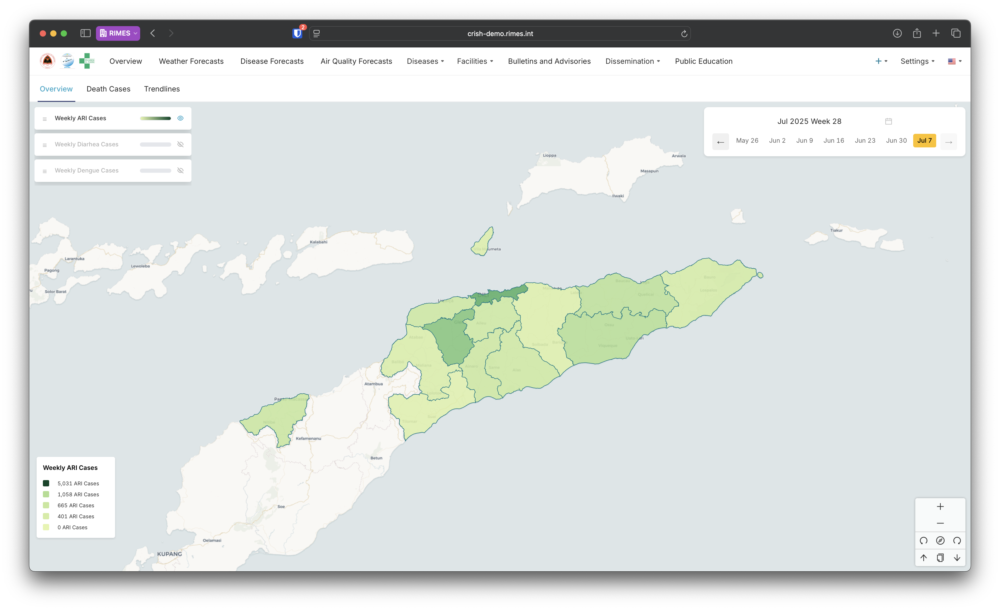

# CRISH Platform Health Official Training Manual

## Document Version: 1.0
## Date: August 2025
## Target Audience: Health Officials, Data Analysts, Decision Makers
## Languages: English | Português | Tetum

---

## Table of Contents
1. [Introduction](#introduction)
2. [System Overview](#system-overview)
3. [Dashboard Navigation](#dashboard-navigation)
4. [Disease Monitoring](#disease-monitoring)
5. [Weather Analysis](#weather-analysis)
6. [Alert Management](#alert-management)
7. [Air Quality Monitoring](#air-quality-monitoring)
8. [Public Education Module](#public-education-module)
9. [Bulletin Creation](#bulletin-creation)
10. [Report Generation](#report-generation)
11. [Data Interpretation](#data-interpretation)
12. [Quick Reference Guide](#quick-reference-guide)

---

## Introduction

Welcome to the CRISH Platform Health Official Training Manual. This guide will equip you with the skills needed to monitor disease patterns, analyze weather impacts on health, manage alerts, and create public health bulletins for Timor-Leste.

### Learning Objectives
By the end of this training, you will be able to:
- Navigate and use all CRISH dashboards effectively
- Interpret disease forecasting data and trends
- Understand weather-health correlations
- Create and disseminate health bulletins
- Generate reports for decision-making
- Respond to alerts promptly and appropriately

### Your Role in the System
As a Health Official, you are responsible for:
- Monitoring disease trends and outbreaks
- Analyzing weather impacts on public health
- Creating timely health advisories
- Coordinating response efforts
- Informing policy decisions with data

---

## System Overview

### CRISH Platform Purpose
The Climate Resilient Infrastructure and System for Health (CRISH) platform integrates:
- **Disease surveillance data** from health facilities
- **Weather forecasting** from meteorological services
- **Predictive modeling** using artificial intelligence
- **Multi-channel communication** for public health messaging

### Key Features for Health Officials
1. **Real-time Dashboards**: Visual monitoring of health and climate data
2. **Predictive Analytics**: 7-day disease forecasts using AI
3. **Alert System**: Automated notifications for health threats
4. **Bulletin System**: Multi-language health advisory creation
5. **Report Generation**: Data export and analysis tools

---

## Dashboard Navigation

### Accessing the System

1. **Login Process**
   ```
   URL: https://crish-demo.rimes.int
   Username: [your_email]
   Password: [your_password]
   ```
   
2. **Home Dashboard**
   - Overview of current health situation
   - Quick access to all modules
   - Recent alerts and notifications

### Main Dashboard Sections

#### 1. Disease Overview Dashboard


**Key Components:**
- Current disease cases by municipality
- Trend charts (daily, weekly, monthly)
- Heat map of disease distribution
- Top affected areas

**How to Use:**
1. Select date range using calendar picker
2. Choose disease type from dropdown
3. Click on municipality for detailed view
4. Export data using download button

#### 2. Weather Overview Dashboard


**Key Components:**
- Current weather conditions
- 7-day forecast
- Weather alerts and warnings
- Historical weather patterns

**Navigation Tips:**
- Use zoom controls for map interaction
- Click legends to show/hide data layers
- Hover over charts for detailed values

---

## Disease Monitoring

### Understanding Disease Data

#### 1. Disease Types Monitored
- **Dengue Fever**: Vector-borne disease linked to rainfall
- **Malaria**: Mosquito-transmitted, weather-sensitive
- **Diarrheal Diseases**: Water and sanitation related
- **Respiratory Infections**: Temperature and humidity influenced

#### 2. Key Metrics to Monitor

**Incidence Rate**
```
Incidence = (New Cases / Population) × 10,000
```
- Normal: <10 per 10,000
- Alert: 10-50 per 10,000
- Outbreak: >50 per 10,000

**Trend Analysis**
- **Increasing**: ↑ Three consecutive periods of growth
- **Stable**: ↔ Variation within 10%
- **Decreasing**: ↓ Three consecutive periods of decline

### Using the Disease Forecast Dashboard

#### Step-by-Step Guide:

1. **Access Forecast Module**
   - Click "Disease Forecast" from main menu
   - System shows 7-day predictions

2. **Interpret Forecast Data**
   ```
   Example Reading:
   Municipality: Dili
   Disease: Dengue
   Current Cases: 45
   7-Day Forecast: 52 (↑15%)
   Confidence: 85%
   ```

3. **Factors Influencing Predictions**
   - Historical disease patterns
   - Current weather conditions
   - Seasonal trends
   - Population density

4. **Taking Action Based on Forecasts**
   - **Low Risk (Green)**: Continue routine monitoring
   - **Medium Risk (Yellow)**: Increase surveillance, prepare resources
   - **High Risk (Red)**: Activate response plan, issue alerts

### Case Study: Dengue Outbreak Response

**Scenario**: System predicts 40% increase in dengue cases for Dili next week

**Actions Taken:**
1. Review forecast details and contributing factors
2. Check weather forecast (heavy rain expected)
3. Coordinate with vector control teams
4. Prepare public health advisory
5. Alert health facilities to prepare resources

---

## Weather Analysis

### Weather-Health Relationships

#### 1. Key Weather Parameters

| Parameter | Health Impact | Threshold Values |
|-----------|--------------|------------------|
| Heat Index | Heat stress, heat stroke risk | >33°C = Extreme Danger, ≥30°C = Danger, ≥27°C = Extreme Caution |
| Rainfall | Mosquito breeding, flooding risk | >60mm = Extreme Danger, ≥25mm = Danger, ≥15mm = Extreme Caution |
| Wind Speed | Structural damage, flying debris | >25km/h = Extreme Danger, ≥20km/h = Danger, ≥15km/h = Extreme Caution |

#### 2. Seasonal Patterns in Timor-Leste

**Wet Season (December-April)**
- Increased dengue and malaria risk
- Flooding and waterborne diseases
- Transportation challenges

**Dry Season (May-November)**
- Respiratory infections
- Water scarcity issues
- Dust-related health problems

### Using Weather Data for Health Planning

#### Example: Rainfall and Dengue Correlation

1. **Access Weather-Disease Analysis**
   - Open "Analytics" menu
   - Select "Weather-Disease Correlation"

2. **Interpret the Correlation Chart**
   ```
   Rainfall (mm) | Dengue Cases (2 weeks later)
   0-25         | 10-15 cases
   25-50        | 15-25 cases
   50-100       | 25-40 cases
   >100         | 40+ cases
   ```

3. **Preventive Actions**
   - Pre-position mosquito control supplies
   - Community education campaigns
   - Coordinate with municipal teams

---

## Air Quality Monitoring

### Understanding Air Quality Data

The CRISH platform monitors air quality through multiple monitoring stations across Timor-Leste, tracking key pollutants that affect public health.

#### 1. Air Quality Parameters Monitored

| Parameter | Health Impact | Measurement Unit |
|-----------|--------------|------------------|
| PM1 | Fine particulate matter affecting respiratory system | μg/m³ |
| PM2.5 | Fine particles penetrating deep into lungs | μg/m³ |
| PM10 | Coarse particles causing respiratory irritation | μg/m³ |
| CO2 | Carbon dioxide levels affecting indoor air quality | ppm |

#### 2. Air Quality Status Classification

The system uses a color-coded status system:

- **Green**: Good air quality - No health concerns
- **Yellow**: Moderate - Sensitive individuals may experience minor issues
- **Orange**: Unhealthy for Sensitive Groups - Children, elderly, and those with respiratory conditions should limit outdoor activities
- **Red**: Unhealthy - Everyone should reduce prolonged outdoor activities
- **Purple**: Very Unhealthy - Health warnings for all populations
- **Maroon**: Hazardous - Emergency conditions, entire population at risk

#### 3. Using Air Quality Data for Health Planning

**Daily Monitoring:**
1. Access "Air Quality" dashboard from main menu
2. View real-time readings from monitoring stations
3. Check 24-hour trends and forecasts
4. Monitor status changes and alerts

**Health Advisory Creation:**
- Issue advisories when levels reach "Unhealthy for Sensitive Groups" or higher
- Coordinate with schools and healthcare facilities
- Recommend indoor activities during poor air quality periods
- Advise vulnerable populations to avoid outdoor exercise

**Example Air Quality Alert:**
```
Air Quality Alert - Dili Municipality
Current PM2.5: 75 μg/m³ (Unhealthy)
Status: Orange

Health Recommendations:
• Sensitive individuals should avoid outdoor activities
• Close windows and use air filtration if available
• Postpone outdoor sports and exercise
• Seek medical attention if experiencing difficulty breathing

For updates: Check crish-demo.rimes.int
```

### Air Quality Station Management

#### Monitoring Station Network
- Multiple stations across municipalities
- Real-time data transmission
- Quality assurance protocols
- Maintenance scheduling

#### Data Quality Indicators
- Station operational status
- Data completeness percentage
- Calibration status
- Communication status

---

## Public Education Module

### Health Education Content Management

The Public Education module helps health officials create and distribute educational content to improve community health awareness.

#### 1. Content Types Available

**Educational Posts**
- Disease prevention guides
- Seasonal health tips  
- Vaccination campaigns
- Nutrition and wellness advice

**Multi-media Support**
- PDF attachments for detailed guides
- Images and infographics
- Video content support
- Social media optimized formats

#### 2. Creating Educational Content

**Step-by-Step Process:**

1. **Access Education Module**
   ```
   Main Menu → Public Education → Create New Post
   ```

2. **Content Creation**
   - Title: Clear, engaging headline
   - Content: Health information in simple language
   - Attachments: Supporting documents or images
   - Target Audience: General public, parents, elderly, etc.

3. **Multi-language Support**
   - English version (primary)
   - Tetum translation
   - Portuguese translation (if needed)

4. **Social Media Integration**
   - Add relevant hashtags (#CRISHHealth #TimorLesteHealth)
   - Optimize for Facebook sharing
   - Format for WhatsApp distribution

5. **Review and Publish**
   - Preview all language versions
   - Schedule publication time
   - Select distribution channels
   - Submit for approval

#### 3. Content Distribution Channels

**Available Platforms:**
- [ ] CRISH website
- [ ] Facebook page
- [ ] WhatsApp groups
- [ ] Email newsletters
- [ ] Print materials (PDF)

**Best Practices:**
- Use simple, culturally appropriate language
- Include visual elements when possible
- Provide actionable health advice
- Reference official health guidelines
- Update content regularly

#### 4. Content Performance Tracking

**Metrics Available:**
- View counts and engagement
- Share statistics
- Download numbers for PDFs
- Feedback and comments

**Popular Content Topics:**
- Seasonal disease prevention
- Child health and vaccination
- Maternal health guidance
- Emergency preparedness
- Mental health awareness

### Example Educational Post

```
Title: Dengue Prevention During Rainy Season

Content:
The rainy season increases dengue risk in our communities. 
Here's how to protect your family:

🏠 Remove standing water around your home
🛏️ Use mosquito nets while sleeping  
👕 Wear long sleeves during dawn and dusk
🏥 Seek medical care immediately for fever

Early symptoms include:
• High fever
• Severe headache
• Pain behind the eyes
• Joint and muscle pain

Remember: Early treatment saves lives!

Hashtags: #DenguePrevention #CRISHHealth #TimorLesteHealth #RainySeason
```

---

## Alert Management

### Alert Types and Priorities

#### 1. Alert Categories

**Disease Alerts**
- Outbreak threshold exceeded
- Unusual disease patterns
- Rapid increase in cases

**Weather Alerts**
- Extreme weather warnings
- Climate-related health risks
- Natural disaster threats

**System Alerts**
- Data quality issues
- Missing reports
- Technical problems

#### 2. Alert Priority Levels

| Level | Color | Response Time | Example |
|-------|--------|--------------|---------|
| Critical | Red | Immediate | Disease outbreak confirmed |
| High | Orange | Within 2 hours | Outbreak threshold approaching |
| Medium | Yellow | Within 24 hours | Unusual pattern detected |
| Low | Blue | Within 48 hours | Routine monitoring alert |

### Managing Alerts Effectively

#### Alert Response Workflow

1. **Receive Alert**
   - Desktop notification
   - Email notification
   - SMS (for critical alerts)

2. **Assess Alert**
   ```
   Alert Details:
   Type: Disease Outbreak
   Location: Baucau Municipality
   Disease: Malaria
   Cases: 45 (threshold: 30)
   Trend: Increasing
   ```

3. **Verify Information**
   - Check raw data
   - Contact health facility
   - Review recent reports

4. **Take Action**
   - Document response
   - Coordinate with teams
   - Create public advisory
   - Monitor situation

5. **Close Alert**
   - Update status
   - Record outcomes
   - Document lessons learned

### Alert Configuration

**Setting Custom Alerts**
1. Navigate to Settings → Alerts
2. Click "Create New Alert"
3. Define conditions:
   - Disease type
   - Threshold value
   - Geographic area
   - Time period
4. Set notification preferences
5. Save and activate

---

## Bulletin Creation

### Multi-Channel Health Communication

#### 1. Bulletin Types

**Routine Health Updates**
- Weekly disease summary
- Preventive health tips
- Service announcements

**Alert Bulletins**
- Outbreak notifications
- Weather warnings
- Emergency instructions

**Educational Content**
- Disease prevention guides
- Health best practices
- Community resources

#### 2. Creating Effective Bulletins

### Step-by-Step Bulletin Creation

1. **Access Bulletin Module**
   ```
   Main Menu → Bulletins → Create New
   ```

2. **Select Template**
   - Disease Alert Template
   - Weather Advisory Template
   - General Health Update
   - Custom Template

3. **Fill Content (Multi-language)**
   
   **English Version:**
   ```
   Title: Dengue Prevention Advisory - Dili Municipality
   
   Dear Residents,
   
   The Ministry of Health alerts increased dengue risk due to recent rainfall. 
   Please take these preventive measures:
   
   • Remove standing water around homes
   • Use mosquito nets while sleeping
   • Wear long sleeves during dawn/dusk
   • Seek medical care for fever symptoms
   
   For more information: Call 119
   ```
   
   **Tetum Version:**
   ```
   Títulu: Avizu Prevensaun Dengue - Munisípiu Dili
   
   Maluk sira,
   
   Ministériu Saúde fó hatene katak risku dengue aumenta tanba udan foin dadauk.
   Favor halo prevensaun tuir mai:
   
   • Hasai bee tahan iha uma nia laran
   • Uza kaskeiru muskitu bainhira toba
   • Uza kamiza naruk iha tempu dader/lokraik
   • Buka ajuda médiku bainhira isin-manas
   
   Informasaun tan: Telefone 119
   ```

4. **Add Visual Elements**
   - Upload infographics
   - Include warning icons
   - Add contact information

5. **Select Distribution Channels**
   - [ ] WhatsApp Groups
   - [ ] Facebook Page
   - [ ] Email Lists
   - [ ] SMS (for urgent only)

6. **Review and Approve**
   - Preview all versions
   - Check translations
   - Verify contact details
   - Submit for approval

### Best Practices for Health Communication

#### 1. Message Clarity
- Use simple language
- Avoid medical jargon
- Include clear action steps
- Provide contact information

#### 2. Cultural Sensitivity
- Respect local customs
- Use appropriate imagery
- Consider literacy levels
- Include local languages

#### 3. Timing and Frequency
- Send alerts immediately
- Weekly updates on Fridays
- Avoid message fatigue
- Coordinate with other agencies

---

## Report Generation

### Available Report Types

#### 1. Standard Reports

**Disease Surveillance Report**
- Period: Weekly/Monthly
- Content: Case counts, trends, maps
- Format: PDF, Excel, CSV

**Weather Impact Report**
- Period: Monthly/Seasonal
- Content: Weather patterns, health correlations
- Format: PDF with charts

**Alert Summary Report**
- Period: Monthly
- Content: All alerts, responses, outcomes
- Format: PDF, Word

#### 2. Custom Reports

### Creating Custom Reports

1. **Access Report Builder**
   ```
   Menu → Reports → Create Custom Report
   ```

2. **Select Data Sources**
   - [ ] Disease cases
   - [ ] Weather data
   - [ ] Health facilities
   - [ ] Population data

3. **Define Parameters**
   ```
   Date Range: January 1 - January 31, 2025
   Geographic Area: All Municipalities
   Disease Types: Dengue, Malaria
   Aggregation: Daily
   ```

4. **Choose Visualizations**
   - Time series charts
   - Geographic maps
   - Comparison tables
   - Trend indicators

5. **Generate and Export**
   - Preview report
   - Export format (PDF/Excel)
   - Schedule recurring reports

### Report Templates

#### Weekly Surveillance Report Template
```
WEEKLY DISEASE SURVEILLANCE REPORT
Week: [Week Number], [Year]
Period: [Start Date] - [End Date]

EXECUTIVE SUMMARY
- Total Cases This Week: [Number]
- Change from Last Week: [+/-]%
- Municipalities on Alert: [List]
- Key Concerns: [Brief Description]

DISEASE BREAKDOWN
1. Dengue: [Cases] ([Trend])
2. Malaria: [Cases] ([Trend])
3. Diarrhea: [Cases] ([Trend])

GEOGRAPHIC DISTRIBUTION
[Include map]

RECOMMENDATIONS
1. [Action Item 1]
2. [Action Item 2]
3. [Action Item 3]

Prepared by: [Name]
Date: [Date]
```

---

## Data Interpretation

### Understanding Statistical Indicators

#### 1. Key Statistical Concepts

**Moving Averages**
- 7-day average smooths daily variations
- Shows underlying trends
- Reduces noise in data

**Confidence Intervals**
- 95% CI means 95% certainty
- Wider intervals = less certainty
- Consider when making decisions

**Correlation vs Causation**
- Correlation shows relationship
- Doesn't prove cause
- Consider multiple factors

#### 2. Reading Forecast Accuracy

**Understanding Model Performance**
```
Forecast Accuracy Metrics:
- MAPE (Mean Absolute Percentage Error): 15%
  Interpretation: Predictions average 15% off actual
  
- R² (Coefficient of Determination): 0.85
  Interpretation: Model explains 85% of variance
  
- Hit Rate: 78%
  Interpretation: 78% of alerts were accurate
```

### Making Data-Driven Decisions

#### Decision Framework

1. **Assess Data Quality**
   - Check completeness
   - Verify accuracy
   - Consider timeliness

2. **Analyze Trends**
   - Short-term (weekly)
   - Medium-term (monthly)
   - Long-term (yearly)

3. **Consider Context**
   - Seasonal patterns
   - Special events
   - External factors

4. **Evaluate Options**
   - Cost-benefit analysis
   - Resource availability
   - Community impact

5. **Document Decisions**
   - Rationale
   - Expected outcomes
   - Success metrics

### Case Study: Interpreting Complex Data

**Scenario**: Multiple factors affecting disease spread

```
Data Points:
- Dengue cases: ↑30% this week
- Rainfall: 150mm (↑200% from average)
- Temperature: 28°C (normal)
- Holiday season: Yes
- Facility reports: 2 days delayed
```

**Analysis Process:**
1. Identify primary driver (rainfall)
2. Consider confounding factors (holiday travel)
3. Adjust for reporting delays
4. Make proportionate response

**Decision**: Issue moderate alert, increase surveillance

---

## Quick Reference Guide

### Essential Tasks Checklist

#### Daily Tasks
- [ ] Check morning dashboard summary
- [ ] Review overnight alerts
- [ ] Verify data completeness
- [ ] Respond to urgent notifications

#### Weekly Tasks
- [ ] Generate surveillance report
- [ ] Review forecast accuracy
- [ ] Update bulletin content
- [ ] Coordinate with municipalities

#### Monthly Tasks
- [ ] Analyze trend reports
- [ ] Evaluate intervention effectiveness
- [ ] Update contact lists
- [ ] Review system performance

### Keyboard Shortcuts

| Action | Shortcut |
|--------|----------|
| Refresh dashboard | F5 |
| Export data | Ctrl+E |
| New bulletin | Ctrl+N |
| Search | Ctrl+F |
| Help | F1 |

### Common Functions

#### Exporting Data
1. Click chart/table
2. Select "Download"
3. Choose format:
   - PNG (images)
   - CSV (data)
   - PDF (reports)

#### Filtering Data
1. Use date picker for time range
2. Select municipalities from dropdown
3. Choose disease types
4. Apply filters

#### Sharing Information
1. Generate shareable link
2. Export to common formats
3. Use bulletin system for public
4. Email reports to stakeholders

### Troubleshooting

| Issue | Solution |
|-------|----------|
| Dashboard not loading | Clear browser cache, refresh |
| Missing data | Check facility reporting status |
| Can't create bulletin | Verify user permissions |
| Export failing | Try smaller date range |

### Emergency Contacts

- **IT Support**: +670 7xxx xxxx
- **System Admin**: admin@crish.tl
- **MOH Surveillance**: +670 7xxx xxxx
- **Emergency Hotline**: 119

---

## Hands-on Exercises

### Exercise 1: Dashboard Navigation
1. Login to the system
2. Navigate to each dashboard
3. Identify current disease trends
4. Export data from one chart

### Exercise 2: Alert Response
1. Review sample alert
2. Verify the data
3. Draft response plan
4. Create bulletin

### Exercise 3: Report Generation
1. Create weekly surveillance report
2. Include all municipalities
3. Add interpretive comments
4. Export and share

### Exercise 4: Forecast Interpretation
1. Review 7-day disease forecast
2. Identify high-risk areas
3. Plan preventive measures
4. Document decisions

---

## Additional Resources

### Training Videos
- Dashboard Overview (15 min)
- Creating Bulletins (20 min)
- Data Interpretation (25 min)
- Emergency Response (30 min)

### Reference Documents
- Disease Threshold Guidelines
- Weather Parameter Definitions
- Bulletin Templates Library
- Statistical Glossary

### Support Channels
- Technical Support: Contact your system administrator
- Training Questions: Refer to this manual or contact your supervisor

---

## Certification

Complete all exercises and demonstrate proficiency to receive your CRISH Platform Health Official Certificate.

---

*This training manual is regularly updated. Version 1.0 - August 2025*