---
format:
  pdf:
    documentclass: article
    geometry:
      - top=1in
      - left=1in
      - right=1in
      - bottom=1in
    fontsize: 12pt
    colorlinks: true
    include-in-header:
      - text: |
          %=== Fonts & colours ===
          \usepackage{fontspec}
          \usepackage{titlesec}
          \usepackage{xcolor}
          \setmainfont{Arial}
          \newfontfamily\playfont[
            Path = ./fonts/Play/,
            UprightFont = *-Regular,
            BoldFont   = *-Bold,
            Extension  = .ttf,
            Scale      = 1.0]{Play}
          \definecolor{headingcolor}{HTML}{0f4761}

          %=== Heading formats ===
          \titleformat{\section}
            {\playfont\fontsize{20}{24}\selectfont\bfseries\color{headingcolor}}
            {\thesection}{1em}{}

          \titleformat{\subsection}
            {\playfont\fontsize{16}{19.2}\selectfont\bfseries\color{headingcolor}}
            {\thesubsection}{1em}{}

          \titleformat{\subsubsection}
            {\playfont\fontsize{14}{16.8}\selectfont\bfseries\color{headingcolor}}
            {\thesubsubsection}{1em}{}

          \titleformat{\paragraph}
            {\playfont\fontsize{12}{14.4}\selectfont\itshape\color{headingcolor}}
            {\theparagraph}{1em}{}
     
  docx:
    fig-width: 6.0
    fig-height: 4.0
    fig-dpi: 300
    prefer-html: true
    mermaid-format: png
    keep-md: true
    df-print: kable
    toc: true
    toc-depth: 2
    number-sections: true
    highlight-style: github
    fig-align: center
    fig-cap-location: bottom
    block-headings: false
    mermaid:
      theme: default
      width: 800
      height: 600
toc: true
toc_depth: 2
number_sections: true
colorlinks: true
urlcolor: blue
---


# Introduction

The 'Enhancing Early Warning Systems to build greater resilience to hydro-meteorological hazards in Timor-Leste' is a significant USD 21.7 million project, spearheaded by the United Nations Environment Programme (UNEP) and funded by the Green Climate Fund (GCF). Its overarching goal is to establish integrated climate information services and an impact-based Multi-Hazard Early Warning System (MHEWS) for key sectors—including health, agriculture, disaster risk reduction, water, and environmental management—and communities across Timor-Leste. As a core partner in this endeavor, the Regional Integrated Multi-Hazard Early Warning System for Africa and Asia (RIMES) is actively contributing to several project components, notably by co-developing tailored forecasting and decision support systems (DSS) for the health sector, among others.

This specific activity aims to address the growing demand for relevant, timely, and usable information concerning weather and climate variability, change, risks, and their impacts on public health. Its objective is to empower decision-makers to take appropriate actions to ensure community safety and well-being. This will be achieved through institutional strengthening, including the establishment of a national Climate and Health Working Group; the implementation of a hybrid ambient air quality monitoring system and a customized mobile application; and, critically, the co-development and delivery of tailored health forecasting and decision-support systems, including a mobile application.

The Climate Risk Information System for Public Health (CRISH) is designed as a comprehensive, multi-interface platform utilizing React and TypeScript for the frontend, leveraging interactive maps, trend analysis, alert management, and tabular data views. Its backend is powered by a robust architecture encompassing TensorFlow/Keras for machine learning models, specifically LSTM neural networks for disease prediction (dengue, diarrhea), and Flask-AppBuilder for API management and security. It integrates with various data sources, including external APIs (e.g., Visual Crossing for weather) and a PostgreSQL database. The system is built to provide multi-channel dissemination (email, WhatsApp, Facebook, mobile app) for alerts and bulletins. Furthermore, CRISH incorporates an Enhanced Facilities Module for managing health facility information geospatially and features a Comprehensive Multi-Language Architecture supporting English, Portuguese (Timor-Leste variant), and Tetum, ensuring broad accessibility and cultural relevance across Timor-Leste. The robust Custom Authentication System with enhanced user registration, branded interfaces, and advanced security features ensures data integrity and secure access for all users.


# Technical Accomplishments and Milestones

From January to June 2025, the Climate Risk Information System for Public Health (CRISH) made substantial technical progress, significantly boosting Timor-Leste's health resilience. Key achievements include the deployment of an advanced Disease Forecasting and Prediction System, which uses machine learning to predict dengue and diarrhea cases with automated alert generation. Complementing this, robust Visualization Platforms for both disease and weather forecasts were established, offering interactive maps and real-time alerts. The Weather Forecasting and Alert System was strengthened with an automated data acquisition backend and effective alert mechanisms. Furthermore, a sophisticated Integrated Bulletin and Advisory System was developed for multi-format content and multi-channel dissemination, alongside a Public Education Module supporting multiple languages. The Health Facilities Management System gained enhanced geospatial capabilities for visualizing and managing facilities. Underpinning these advancements, CRISH also implemented improved Visualization Components, a comprehensive Multi-Language Architecture, and a secure Custom Authentication System. These efforts collectively empower Timor-Leste with advanced, data-driven public health decision-making and early warning capabilities.

## 1. Disease Forecasting and Prediction System

### 1.1 Advanced Disease Forecast Visualization Platform

The Disease Forecasting and Prediction System represents a comprehensive multi-interface machine learning and visualization platform designed to provide real-time disease insights and alert management across Timor-Leste. The system implements a sophisticated four-tab interface architecture built with React and TypeScript, featuring interactive maps, trend analysis, alert management, and tabular data views integrated through responsive chart containers and API-driven data visualization components.

**Multi-Tab Interface Architecture:**

The disease forecast platform has four specialized visualization modes:

1. **Forecasts Tab**: Interactive multi-layer map-based disease visualization displaying dengue and diarrhea forecasts based on predicted case levels. The interface features comprehensive disease parameter visualization using choropleth mapping with automatic disease-specific color coding based on AI-generated predictions.

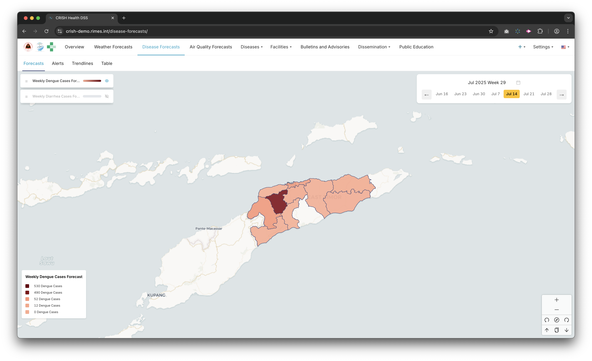{#fig-disease-forecasts-tab fig-align="center"}

2. **Alerts Tab**: Dedicated disease alert visualization interface providing municipality-specific alert mapping with real-time threshold breach notifications using circular indicators overlaid on the geographic map. The alert system displays color-coded alert levels with municipality-specific positioning for both dengue and diarrhea alerts.

{#fig-disease-alerts-tab fig-align="center"}

3. **Trendlines Tab**: Advanced multi-parameter trend analysis component featuring interactive line charts with comprehensive filtering capabilities, threshold visualization, and cross-parameter correlation analysis. The component supports both predicted forecast data and actual case data comparison through dual-line visualization with symbol differentiation.

{#fig-disease-trendlines-tab fig-align="center"}

4. **Table Tab**: Structured tabular data presentation providing detailed disease parameter data with filtering, sorting, and export capabilities showing forecast dates, municipalities, disease types, alert levels, predicted cases, and alert messages for administrative and analytical purposes.

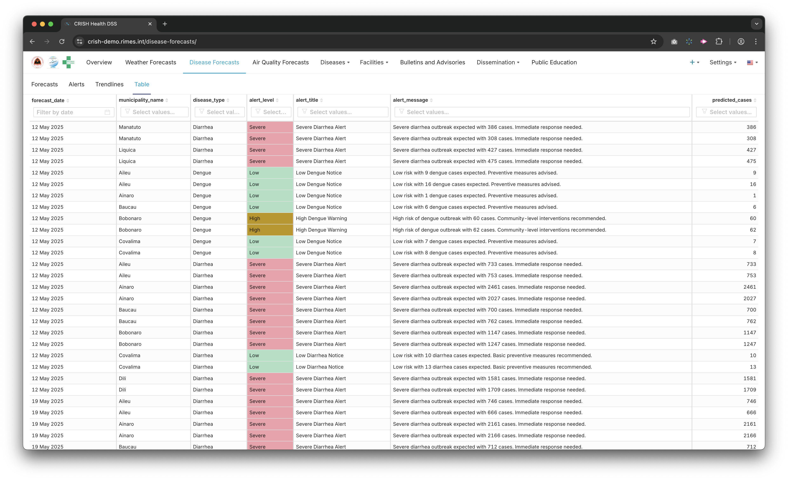{#fig-disease-table-tab fig-align="center"}

### 1.2 Advanced Trendlines Visualization Component

The Trendlines component represents a sophisticated data visualization system built on Apache ECharts with disease parameter analysis capabilities. The component implements dynamic API integration, real-time threshold monitoring, and multi-municipality comparison features designed to support complex epidemiological analysis and decision-making processes.

**Technical Implementation Features:**

- **Multi-Disease Support**: Disease parameter tracking including Dengue and Diarrhea with disease-specific threshold configurations and alert level color mapping
- **Dynamic Data Fetching**: Real-time API integration supporting municipality-specific and national-level data aggregation with automatic year/week range conversion for efficient backend filtering
- **Interactive Filtering System**: Advanced filtering capabilities including municipality selection (14 predefined options), date range picker with start/end date selection using Moment.js, national vs municipality-level aggregation toggle, threshold visualization controls, and actual vs predicted data comparison switches
- **Responsive Chart Rendering**: Dynamic chart sizing using react-virtualized-auto-sizer and responsive design adaptation across different screen sizes and device types

**Threshold-Based Alert Integration:**

The system implements a hardcoded two-tier threshold system for critical disease parameters with color-coded visualization:

**Dengue Fever Thresholds:**

| Alert Level | Dengue Fever Thresholds |
|-------------|-------------------------|
| Severe Alert | ≥ 6 cases |
| High Warning | ≥ 2 cases |
| Moderate Advisory | ≥ 1 case |


**Diarrheal Disease Thresholds:**

| Alert Level | Diarrheal Disease Thresholds |
|-------------|-------------------------|
| Severe Alert | ≥ 100 cases |
| High Warning | ≥ 50 cases |
| Moderate Advisory | ≥ 25 cases |
| Low Notice | ≥ 1 case |


**Chart Visualization Features:**

- **ECharts Integration**: Line chart visualization with smooth curve rendering, customizable symbols (circles for actual data, empty circles for predictions), and interactive tooltip functionality displaying date-specific values with case number formatting
- **Threshold Visualization**: Dashed horizontal reference lines with color-coded labels indicating alert thresholds using markLine configuration, automatic Y-axis scaling to accommodate both data values and threshold markers
- **Multi-Series Display**: Simultaneous visualization of multiple municipalities with distinct color coding using a predefined 9-color palette, legend management with scroll functionality for large datasets, and dual-series support for actual vs predicted data comparison
- **Interactive Elements**: Hover tooltips with formatted date display (DD MMM YYYY), disease-specific case number formatting, threshold breach highlighting with enhanced symbol rendering, and legend-based series toggling

**Advanced Filtering and Controls:**

- **Geographic Controls**: Radio button selection between National and Municipality levels with automatic municipality list clearing for national view
- **Municipality Selection**: Multi-select dropdown with all 14 municipalities, search functionality, and clear all options
- **Temporal Controls**: DatePicker components for start and end date selection with default current week initialization
- **Visualization Toggles**: Switch components for threshold display control and actual vs predicted data comparison
- **Data Integration**: Automatic fetching of both disease forecast alerts and actual case reports with proper data alignment and temporal matching

### 1.3 CRISH Disease Predictor Backend Module

The disease forecasting system represents a TensorFlow/Keras-based machine learning pipeline that leverages LSTM (Long Short-Term Memory) neural networks to predict dengue and diarrhea cases across Timor-Leste's municipalities. The system employs municipality-specific LSTM models (one for each of the 9 regions) with MinMax scaling for data normalization, automatically loading trained models and scalers from the `dengueModels/` and `diarrheaModels/` directories. The system operates through a four-stage prediction pipeline that orchestrates a complete workflow consisting of four main scripts: weather data acquisition, dengue prediction, diarrhea prediction, and database uploading. The pipeline is designed to run on configurable schedules (daily, weekly, or monthly) through Docker containerization, making it highly adaptable to different operational requirements.

The core prediction models are municipality-specific, with separate LSTM networks trained for each of the 9 regions (Aileu, Ainaro, Baucau, Bobonaro, Covalima, Dili, Ermera, Liquica, Manatuto, Viqueque). Each model utilizes MinMax scaling for data normalization and incorporates both historical case data and meteorological variables including temperature, precipitation, humidity, and wind patterns. The models generate multi-week forecasts and automatically trigger alert generation when predicted cases exceed predefined threshold levels.

The alert generation system implements a hardcoded threshold-based approach using hierarchical rule evaluation that considers both absolute case numbers and percentage increases from baseline levels. The system uses predefined threshold constants defined in `DISEASE_THRESHOLDS_DATA` dictionary with separate rules for dengue (6+ cases = Severe, 2+ = High, 1+ = Moderate) and diarrhea (100+ cases = Severe, 50+ = High, 25+ = Moderate, 1+ = Low). The system uses predefined thresholds for different diseases, with alerts categorized into four severity levels and automatically integrated into the bulletin creation system, making bulletins available for manual dissemination to health authorities through the communication platform.

### Disease Prediction Workflow

The complete disease prediction system follows a comprehensive automated pipeline that coordinates weather data acquisition, machine learning predictions, alert generation, and bulletin creation for subsequent manual distribution. 

**High-Level System Overview:**

:::: {.content-visible unless-format="pdf"}


::::::{.cell layout-align="center"}

:::::{.cell-output-display}

::::{#fig-disease-overview}

:::{}

{width="7.6in" height="0.72in"}
:::


Disease Prediction System Overview
::::
:::::
::::::


::::

:::: {.content-visible when-format="pdf"}


::::::{.cell layout-align="center"}

:::::{.cell-output-display}

::::{#fig-disease-overview}

:::{}

{width="6.5in" height="9in"}
:::


Disease Prediction System Overview
::::
:::::
::::::


::::

The system operates through four main phases: 
1. **Data Collection** - gathering weather forecasts and historical disease case data from multiple sources, 
2. **AI Prediction** - using municipality-specific LSTM neural networks to forecast dengue and diarrhea cases for current and next week, 
3. **Alert Generation** - evaluating predictions against predefined thresholds to classify risk levels and generate appropriate warnings, and 
4. **Bulletin Creation** - automatically generating bulletins from alerts and making them available for manual dissemination through multiple communication channels to reach different stakeholder groups.

**Detailed Workflow:**

The following diagram illustrates the detailed end-to-end workflow:

:::: {.content-visible unless-format="pdf"}


::::::{.cell layout-align="center"}

:::::{.cell-output-display}

::::{#fig-disease-workflow}

:::{}

{width="15.94in" height="36.56in"}
:::


Detailed Disease Prediction Workflow
::::
:::::
::::::


::::

:::: {.content-visible when-format="pdf"}


::::::{.cell layout-align="center"}

:::::{.cell-output-display}

::::{#fig-disease-workflow}

:::{}

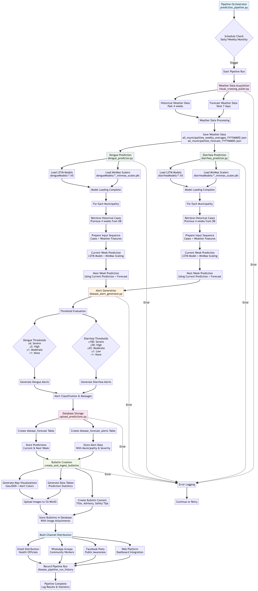{width="6.5in" height="9in"}
:::


Detailed Disease Prediction Workflow
::::
:::::
::::::


::::

**Workflow Components:**

1. **Pipeline Orchestration**: The `prediction_pipeline.py` script manages the entire workflow, scheduling execution daily, weekly, or monthly based on configuration settings.

2. **Weather Data Collection**: The `visual_crossing_puller.py` component fetches both historical (past 4 weeks) and forecast (next 7 days) weather data from the Visual Crossing API, processing temperature, humidity, precipitation, and other meteorological parameters.

3. **LSTM Model Loading**: Municipality-specific LSTM models and MinMax scalers are loaded for both dengue and diarrhea predictions, with separate model files for each of the 9 regions.

4. **Prediction Generation**: For each municipality, the system retrieves historical case data, prepares input sequences combining weather and case features, and generates both current week and next week predictions using the trained LSTM models.

5. **Alert Generation**: The `disease_alert_generator.py` evaluates predictions against predefined thresholds, classifying alerts into severity levels (Severe, High, Moderate, Low, None) with disease-specific criteria.

6. **Database Storage**: The `upload_predictions.py` component stores predictions and alert data in PostgreSQL tables (`disease_forecast` and `disease_forecast_alerts`) with comprehensive metadata.

7. **Bulletin Creation**: Automated bulletin generation includes map visualizations using GeoJSON data, statistical tables, and safety recommendations, with images uploaded to S3/MinIO storage.

8. **Multi-Channel Distribution**: Bulletins and alerts are distributed through email lists, WhatsApp groups, Facebook posts, and the web platform dashboard for comprehensive reach across different stakeholder groups.

9. **Pipeline Monitoring**: Each pipeline run is logged in the `disease_pipeline_run_history` table with execution statistics, error tracking, and performance metrics for operational oversight.

### Disease Forecast Alert Thresholds

The system implements disease-specific threshold configurations that determine when alerts are generated and their severity levels:

**Dengue Fever Thresholds**:

<!-- Render as table -->
| Alert Level | Dengue Fever Thresholds |
|-------------|-------------------------|
| Severe Alert | ≥ 6 cases |
| High Warning | ≥ 2 cases |
| Moderate Advisory | ≥ 1 case |
<!-- 
-  **Severe Alert (≥ 6 cases)**: "Severe dengue outbreak expected with [cases] cases. Immediate preventive action required."
- **High Warning (≥ 2 cases)**: "High risk of dengue outbreak with [cases] cases. Community-level interventions recommended."
- **Moderate Advisory (≥ 1 case)**: "Moderate risk with [cases] dengue cases expected. Monitor local conditions and take precautions."
- **No Alert (< 1 case)**: "No significant dengue risk at this time." -->

**Diarrheal Disease Thresholds**:

<!-- Render as table -->
| Alert Level | Diarrheal Disease Thresholds |
|-------------|-------------------------|
| Severe Alert | ≥ 100 cases |
| High Warning | ≥ 50 cases |
| Moderate Advisory | ≥ 25 cases |
| Low Notice | ≥ 1 case |
<!-- -  **Severe Alert (≥ 100 cases)**: "Severe diarrhea outbreak expected with [cases] cases. Immediate response needed."
- **High Warning (≥ 50 cases)**: "High risk of diarrhea outbreak with [cases] cases. Community action advised."
- **Moderate Advisory (≥ 25 cases)**: "Moderate risk with [cases] diarrhea cases expected. Monitor hygiene and water quality."
- **Low Notice (≥ 1 case)**: "Low risk with [cases] diarrhea cases expected. Basic preventive measures recommended."
- **No Alert (< 1 case)**: "No significant diarrhea risk at this time." -->

Each threshold configuration includes specific prevention measures and community response guidelines:

**Dengue Prevention Measures**:

-  Eliminate standing water where mosquitoes can breed
- Use mosquito repellent on exposed skin
- Wear long-sleeved shirts and long pants
- Use mosquito nets while sleeping
- Install screens on windows and doors

**Diarrhea Prevention Measures**:

-  Wash hands thoroughly with soap and water, especially before handling food
- Ensure drinking water is clean and properly treated
- Cook food thoroughly and maintain proper food storage
- Practice good personal hygiene
- Maintain clean sanitation facilities

### 1.4 Disease Forecast Alerts API

The Disease Forecast Alerts API provides a dual-model RESTful interface with 7 exposed endpoints for managing disease forecasting data and alert systems. The API architecture follows Superset's Flask-AppBuilder pattern with full CRUD operations, composite key handling (municipality_code_forecast_date_disease_type), and integration with the broader health information ecosystem. The API supports GET, POST, PUT, and DELETE operations for managing disease forecast records, with complex query parameter handling including composite ID management (municipality_code_forecast_date_disease_type), SQLAlchemy subqueries for date range filtering, and Marshmallow schema validation for filtering by date ranges, municipalities, disease types, and alert severity levels.

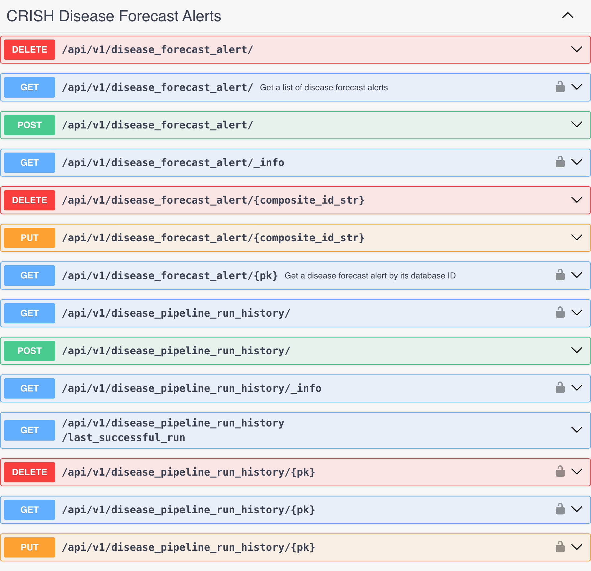{#fig-disease-forecast-alerts-api fig-align="center"}

The alert management system includes automated threshold monitoring where the API continuously evaluates incoming prediction data against configurable thresholds for each municipality and disease type. When thresholds are exceeded, the system automatically generates alerts with appropriate severity classifications and creates bulletins that are made available for manual dissemination through the communication platform. The API also provides endpoints for historical alert analysis, trend visualization data, and performance metrics that help health authorities understand the effectiveness of the forecasting system.

Integration with the bulletin system allows for automatic inclusion of forecast data and alerts in regular health communications, while the flexible threshold configuration enables health authorities to adjust alert sensitivity based on local conditions and public health priorities.

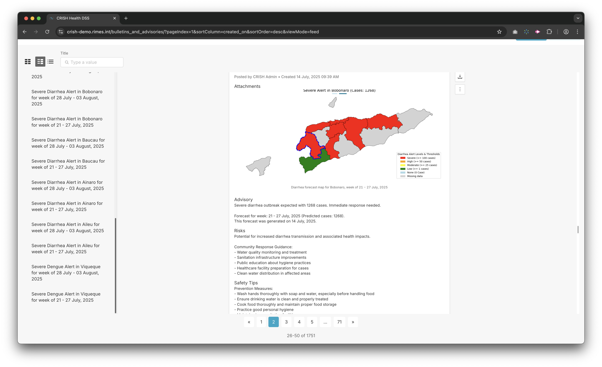{#fig-disease-bulletin fig-align="center"}

### 1.5 Disease Management Interface

The disease management interface provides a multi-module web-based platform with specialized ARI, dengue, and diarrheal disease dashboards for visualizing, analyzing, and managing disease surveillance data across Timor-Leste. The interface consists of multiple specialized modules including overview dashboards for ARI (Acute Respiratory Infections), dengue fever, and diarrheal diseases, each providing tailored visualization and analysis tools appropriate for the specific disease characteristics.

<!-- TODO: Add screenshots of the disease management interface -->
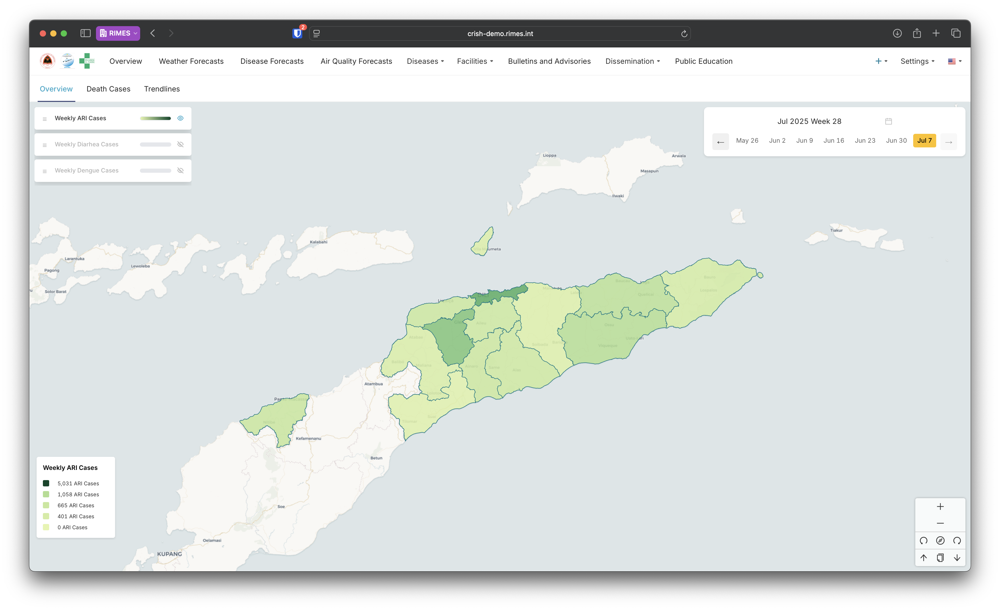{#fig-disease-overview-interface fig-align="center"}

The main disease overview dashboard provides real-time visualization of current disease trends through interactive charts and maps, allowing health officials to quickly identify emerging patterns or outbreaks. The system includes advanced trendline visualization capabilities that display both historical case data and future predictions from the LSTM models, enabling users to understand both current situations and potential future scenarios.

The case report update interface allows authorized users to input new surveillance data through user-friendly forms with built-in validation and quality control measures. The interface includes bulk update capabilities for processing multiple case reports simultaneously, as well as individual case tracking for detailed epidemiological investigation. The system maintains complete audit trails of all data modifications and provides role-based access controls to ensure data integrity and appropriate access levels for different user types.

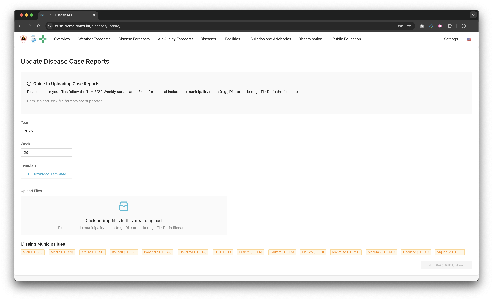{#fig-disease-bulk-update fig-align="center"}

## 2. Weather Forecasting and Alert System

### 2.1 Advanced Weather Forecast Visualization Platform

The Weather Forecasting and Alert System represents a comprehensive multi-interface visualization and monitoring platform designed to provide real-time weather insights and alert management across Timor-Leste. The system implements a sophisticated four-tab interface architecture built with React and TypeScript, featuring interactive maps, trend analysis, alert management, and tabular data views integrated through responsive chart containers and API-driven data visualization components.

**Multi-Tab Interface Architecture:**

The weather forecast platform has four specialized visualization modes:

1. **Forecasts Tab**: Interactive map-based weather visualization displaying heat index forecasts with color-coded geographical regions based on risk levels (Normal/Green, Caution/Yellow, Danger/Orange, Extreme/Red). The interface features a comprehensive sidebar with multiple weather parameter selections including Heat Index Forecast, Max Temperature Forecast, Relative Humidity Forecast, Rainfall Forecast, Wind Speed Forecast, and Min Temperature Forecast, allowing users to dynamically switch between different meteorological parameters while maintaining the same geographic visualization framework.

{#fig-weather-forecasts-tab fig-align="center"}

2. **Alerts Tab**: Dedicated weather alert visualization interface providing municipality-specific alert mapping with real-time threshold breach notifications and emergency response guidance

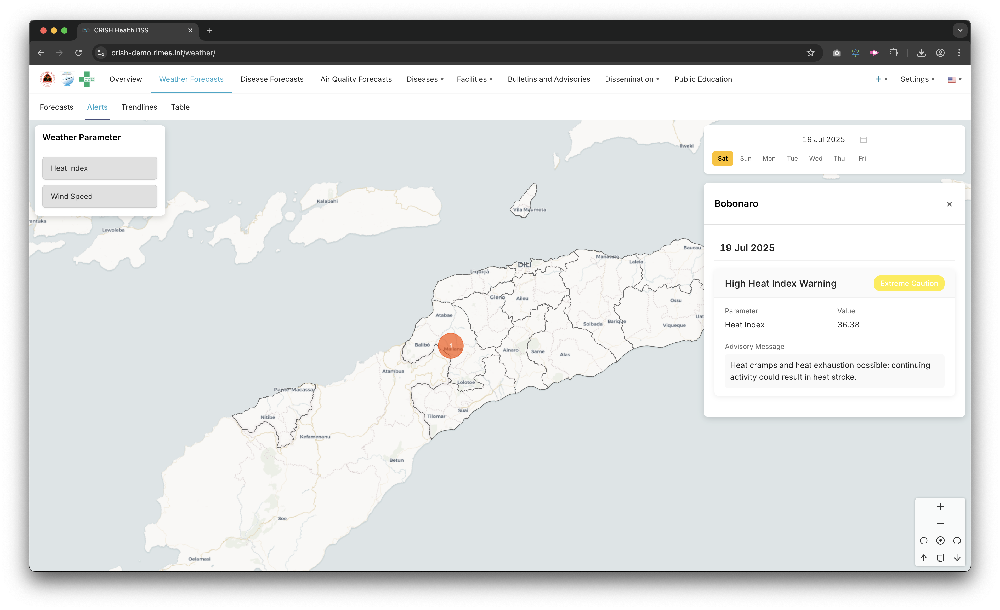{#fig-weather-alerts-tab fig-align="center"}

3. **Trendlines Tab**: Advanced multi-parameter trend analysis component featuring ECharts-powered interactive line charts with comprehensive filtering capabilities, threshold visualization, and cross-parameter correlation analysis

{#fig-weather-trendlines-tab fig-align="center"}

4. **Table Tab**: Structured tabular data presentation providing detailed weather parameter data with filtering, sorting, and export capabilities for administrative and analytical purposes

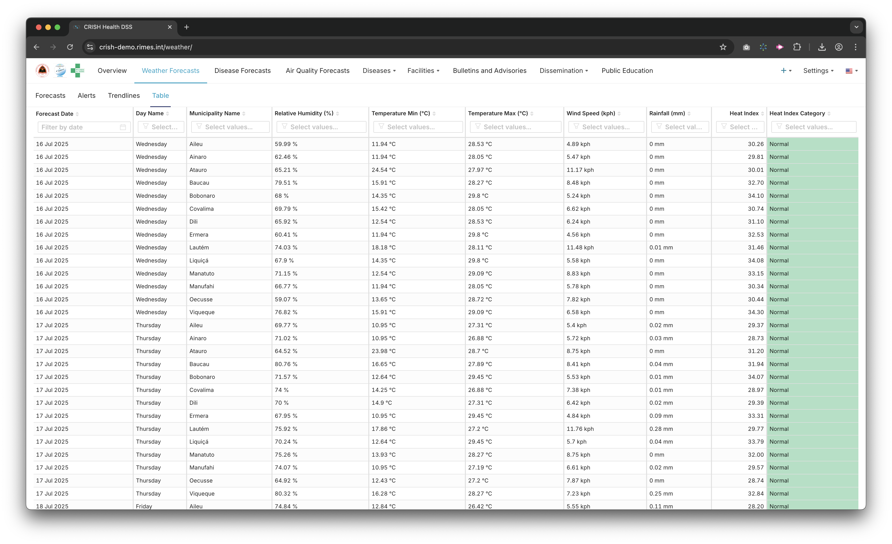{#fig-weather-table-tab fig-align="center"}

### 2.2 Advanced Trendlines Visualization Component

The Trendlines component represents a data visualization system built on Apache ECharts with weather parameter analysis capabilities. The component implements dynamic API integration, real-time threshold monitoring, and multi-municipality comparison features designed to support complex meteorological analysis and decision-making processes.

**Technical Implementation Features:**

- **Multi-Parameter Support**: Weather parameter tracking including Heat Index (°C), Relative Humidity (%), Max/Min Temperature (°C), Rainfall (mm), and Wind Speed (km/h) with parameter-specific units and formatting
- **Dynamic Data Fetching**: Real-time API integration supporting municipality-specific and national-level data aggregation
- **Interactive Filtering System**: Advanced filtering capabilities including municipality selection (14 predefined options), date range picker with start/end date selection, national vs municipality-level aggregation toggle, and threshold visualization controls
- **Responsive Chart Rendering**: Dynamic chart sizing and responsive design adaptation across different screen sizes and device types

**Threshold-Based Alert Integration:**

The system implements a hardcoded three-tier threshold system for critical weather parameters with color-coded visualization:

**Heat Index Thresholds:**

<!-- Render as table -->
| Alert Level | Heat Index Thresholds |
|-------------|-------------------------|
| Extreme Danger | ≥ 42°C |
| Danger | ≥ 40°C |
| Extreme Caution | ≥ 36°C |

<!-- - **Extreme Danger (≥42°C)**: Red indicators (#d32f2f) with triangle symbols
- **Danger (≥40°C)**: Orange indicators (#ef6c00) with enhanced symbol visibility  
- **Extreme Caution (≥36°C)**: Yellow indicators (#fdd835) with warning markers -->

**Rainfall Thresholds:**

<!-- Render as table -->
| Alert Level | Rainfall Thresholds |
|-------------|-------------------------|
| Extreme Danger | ≥ 100mm |
| Danger | ≥ 50mm |
| Extreme Caution | ≥ 20mm |
<!-- - **Extreme Danger (≥100mm)**: Critical flood risk indicators
- **Danger (≥50mm)**: Significant precipitation warnings
- **Extreme Caution (≥20mm)**: Moderate rainfall advisories -->

**Wind Speed Thresholds:**

<!-- Render as table -->
| Alert Level | Wind Speed Thresholds |
|-------------|-------------------------|
| Extreme Danger | ≥ 25km/h |
| Danger | ≥ 20km/h |
| Extreme Caution | ≥ 15km/h |
<!-- - **Extreme Danger (≥25km/h)**: Severe wind condition alerts
- **Danger (≥20km/h)**: Strong wind advisories
- **Extreme Caution (≥15km/h)**: Moderate wind notifications -->

**Chart Visualization Features:**

- **ECharts Integration**: Line chart visualization with smooth curve rendering, customizable symbols, and interactive tooltip functionality displaying date-specific values with proper unit formatting
- **Threshold Visualization**: Dashed horizontal reference lines with color-coded labels indicating alert thresholds, automatic Y-axis scaling to accommodate both data values and threshold markers
- **Multi-Series Display**: Simultaneous visualization of multiple municipalities with distinct color coding using a predefined color palette, legend management with scroll functionality for large datasets
- **Interactive Elements**: Hover tooltips with formatted date display (DD MMM YYYY), parameter-specific unit labeling, and threshold breach highlighting with enhanced symbol rendering

### 2.3 CRISH Weather Forecast Puller Backend System

The CRISH Weather Forecast Puller represents a Polars-based automated weather data acquisition system designed to integrate multiple meteorological data sources for multi-source automated weather monitoring across Timor-Leste. The system employs high-performance data processing using Polars DataFrame operations for efficient transformation of large weather datasets, with automated ECMWF API integration and Visual Crossing service support. The system implements a robust data collection pipeline capable of handling multiple weather APIs including ECMWF (European Centre for Medium-Range Weather Forecasts) and Visual Crossing services.

The architecture employs Docker containerization with automated scheduling, allowing for flexible data collection intervals ranging from hourly to daily updates depending on data source capabilities and operational requirements. The system includes robust error handling with automatic retry mechanisms and fallback procedures to ensure data continuity even during network disruptions or API service interruptions.

The weather parameter threshold monitoring system defines critical thresholds using hardcoded constants for various meteorological parameters including temperature extremes, precipitation levels, wind speeds, and humidity ranges. The system implements automatic heat index calculations using temperature and relative humidity data with Polars-based data merging operations. When these thresholds are exceeded, the system automatically generates weather alerts that are integrated into the broader CRISH alert distribution network. The system processes and transforms raw weather data into standardized formats suitable for both machine learning model input and direct visualization in the dashboard interface.

### Weather Forecast Puller Workflow

The weather forecast puller system operates through an automated pipeline that combines data acquisition, processing, alert generation, and distribution components.

**High-Level System Overview:**

:::: {.content-visible unless-format="pdf"}


::::::{.cell layout-align="center"}

:::::{.cell-output-display}

::::{#fig-weather-overview}

:::{}

{width="10.2in" height="0.72in"}
:::


Weather Forecast System Overview
::::
:::::
::::::


::::

:::: {.content-visible when-format="pdf"}


::::::{.cell layout-align="center"}

:::::{.cell-output-display}

::::{#fig-weather-overview}

:::{}

{width="6.5in" height="9in"}
:::


Weather Forecast System Overview
::::
:::::
::::::


::::

The system operates through four main phases: (1) **Data Acquisition** - pulling weather forecast data from DATAEX and ECMWF APIs for multiple meteorological parameters, (2) **Data Processing** - using Polars for high-performance data transformation and derived parameter calculations like heat index, (3) **Alert Generation** - evaluating weather parameters against predefined thresholds to classify risk levels and generate warnings, and (4) **Storage & Distribution** - storing processed data in PostgreSQL and automatically creating bulletins for high-severity weather alerts.

**Detailed Workflow:**

The following diagram illustrates the comprehensive weather data processing pipeline:


:::: {.content-visible unless-format="pdf"}


::::::{.cell layout-align="center"}

:::::{.cell-output-display}

::::{#fig-weather-pipeline}

:::{}

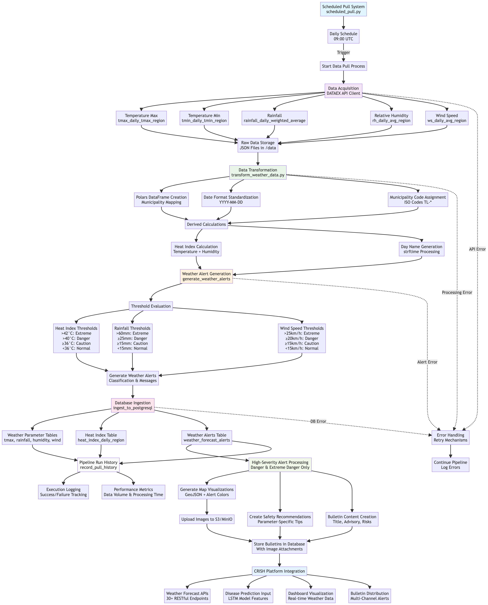{width="19.28in" height="23.84in"}
:::


Weather Data Processing Pipeline
::::
:::::
::::::


::::

:::: {.content-visible when-format="pdf"}


::::::{.cell layout-align="center"}

:::::{.cell-output-display}

::::{#fig-weather-pipeline}

:::{}

{width="6.5in" height="9in"}
:::


Weather Data Processing Pipeline
::::
:::::
::::::


::::

**Workflow Components:**

1. **Scheduled Orchestration**: The `scheduled_pull.py` script manages daily execution at 09:00 UTC, with automated startup and graceful shutdown handling.

2. **Multi-Parameter Data Acquisition**: Connects to DATAEX API to pull five weather parameters (temperature max/min, rainfall, humidity, wind speed) with proper authentication and error handling.

3. **High-Performance Processing**: Uses Polars DataFrames for efficient data transformation, including municipality code mapping, date standardization, and derived parameter calculations.

4. **Automated Alert Generation**: Evaluates each weather parameter against predefined thresholds, generating color-coded alerts with severity-appropriate messaging and safety recommendations.

5. **Database Integration**: Stores processed weather data and alerts in PostgreSQL with proper table schemas, supporting both historical analysis and real-time access.

6. **Intelligent Bulletin Creation**: Automatically generates bulletins only for high-severity alerts (Danger/Extreme Danger), including map visualizations and parameter-specific safety guidance.

7. **System Integration**: Provides weather data to disease prediction models, dashboard visualizations, and multi-channel alert distribution systems within the broader CRISH ecosystem.

8. **Monitoring and Logging**: Maintains comprehensive execution logs, performance metrics, and error tracking in the `weather_pull_history` table for operational oversight.

### Weather Parameter Alert Thresholds

The weather forecasting system implements multi-parameter threshold monitoring for three meteorological parameters (heat index, rainfall, wind speed) using a four-tier alert classification system:

**Heat Index Thresholds (°C)**:

<!-- Render as table -->
| Alert Level | Heat Index Thresholds |
|-------------|-------------------------|
| Extreme Danger | > 42°C |
| Danger | > 40°C |
| Extreme Caution | ≥ 36°C |
| Normal | < 36°C |
<!-- -  **Extreme Danger (> 42°C)**: "Heat stroke imminent. Avoid any outdoor activities."
- **Danger (> 40°C)**: "Heat cramps and heat exhaustion likely; heat stroke probable with continued exposure."
- **Extreme Caution (≥ 36°C)**: "Heat cramps and heat exhaustion possible; continuing activity could result in heat stroke."
- **Normal (< 36°C)**: "No heat index alerts at this time." -->

**Rainfall Thresholds (mm)**:

<!-- Render as table -->
| Alert Level | Rainfall Thresholds |
|-------------|-------------------------|
| Extreme Danger | > 60mm |
| Danger | ≥ 25mm |
| Extreme Caution | ≥ 15mm |
| Normal | < 15mm |
<!-- -  **Extreme Danger (> 60mm)**: "Severe rainfall expected. High risk of flooding and landslides."
- **Danger (≥ 25mm)**: "Significant rainfall expected. Be vigilant of local alerts."
- **Extreme Caution (≥ 15mm)**: "Moderate rainfall expected. Exercise caution."
- **Normal (< 15mm)**: "No significant rainfall expected." -->

**Wind Speed Thresholds (km/h)**:

<!-- Render as table -->
| Alert Level | Wind Speed Thresholds |
|-------------|-------------------------|
| Extreme Danger | > 25 km/h |
| Danger | ≥ 20 km/h |
| Extreme Caution | ≥ 15 km/h |
<!-- -  **Extreme Danger (> 25 km/h)**: "Extremely strong winds expected. Major damage possible."
- **Danger (≥ 20 km/h)**: "Strong winds expected. Secure loose objects and take precautions."
- **Extreme Caution (≥ 15 km/h)**: "Moderate winds expected. Stay alert for possible disruptions."
- **Normal (< 15 km/h)**: "Calm wind conditions expected." -->

Each weather parameter threshold includes tiered safety recommendations and risk assessments with specific protective actions to guide public health responses and community preparedness actions.

### 2.4 Weather Forecast APIs

The Weather Forecast APIs provide a parameter-specific RESTful interface with 30+ endpoints across 6 weather parameters (wind speed, heat index, rainfall, humidity, temperature max/min) for accessing, managing, and analyzing weather forecast data within the CRISH ecosystem. The API architecture follows modern Flask-AppBuilder patterns with full CRUD operations, composite key management for municipality-date combinations, and seamless integration with both the machine learning prediction pipeline and the front-end visualization components. The system implements automatic day name derivation using Python's `strftime` method and handles multiple weather parameters (wind speed, rainfall, temperature) through separate endpoint handlers.

The weather data API supports complex query operations including temporal filtering (date ranges, forecast horizons), geographic filtering (municipality-level data), and parameter-specific filtering (temperature, precipitation, humidity, wind patterns). The API also provides aggregation endpoints that calculate statistical summaries, trends, and comparative analyses across different time periods and geographic regions.

The weather alert management system within the API continuously monitors incoming forecast data against predefined thresholds and automatically generates alerts when conditions warrant public health attention. These alerts are classified by severity level and are automatically integrated into the bulletin generation system, making them available for manual dissemination through the communication platform. The API also provides historical weather data analysis capabilities, enabling health authorities to understand long-term climate patterns and their relationship to disease patterns.

{#fig-weather-forecast-api fig-align="center"}

### 2.5 Weather Forecast Alerts API

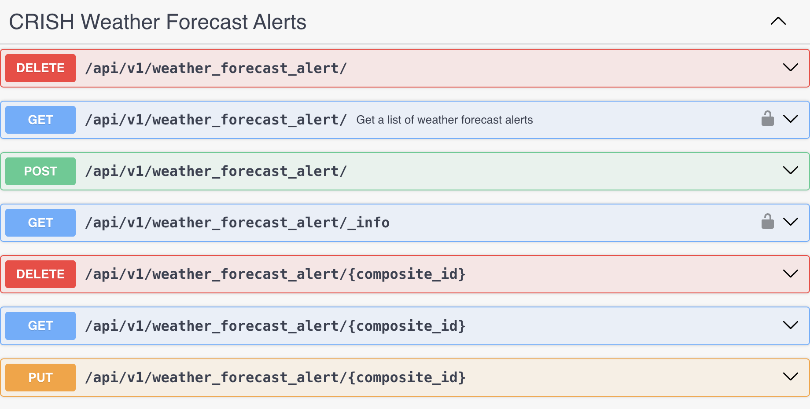{#fig-weather-forecast-alerts-api fig-align="center"}

### 2.6 Air Quality Monitoring

The Air Quality Monitoring system provides mock data-driven management and visualization of air quality data across 14 predefined municipalities with 5-tier AQI classification as an integrated component of the broader environmental health monitoring capabilities. The system manages multiple air quality parameters including particulate matter (PM2.5, PM10), nitrogen dioxide (NO2), ozone (O3), and other pollutants relevant to public health in Timor-Leste.

The system includes DeckGL-based forecast visualization capabilities that present air quality data through interactive choropleth maps with GeoJsonLayer rendering, real-time data streaming using React state management, and Recharts-powered trend analyses. The visualization system employs OpenStreetMap tile layers as base maps and implements automatic color coding based on AQI thresholds. The visualization components are designed to help health authorities identify air quality patterns that may impact respiratory health conditions, particularly in relation to the ARI (Acute Respiratory Infections) monitoring and prediction systems.

Integration with the weather systems allows for cross-parameter environmental health monitoring where air quality data is correlated with meteorological conditions to provide enhanced understanding of environmental factors affecting public health. The system supports automated alert generation when air quality indices exceed healthy levels, with alerts automatically creating bulletins that are made available for manual distribution through the same communication channels used for weather and disease alerts.

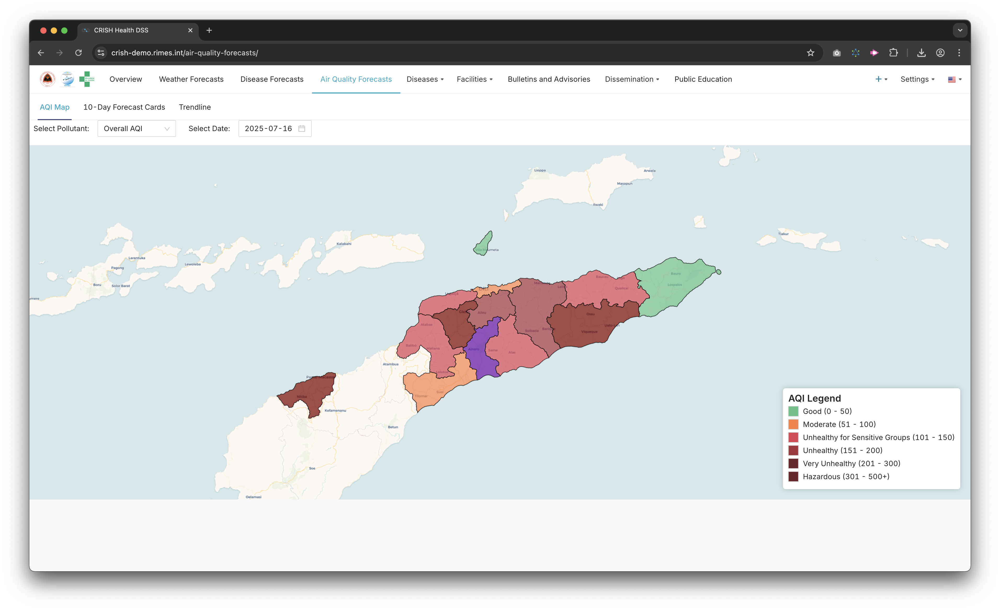{#fig-air-quality-monitoring fig-align="center"}

## 3. Bulletin and Advisory System

### 3.1 Multi-Format Bulletin Management

{#fig-bulletin-advisory-module fig-align="center"}

The Multi-Format Bulletin Management system represents a Flask-AppBuilder-based content creation and distribution platform with PDF generation, S3/MinIO integration, and chart embedding designed to facilitate the creation, management, and dissemination of health advisories and public communications. The system implements multi-part form data handling for file uploads, S3/MinIO object storage integration with presigned URL generation for secure image access, and automatic PDF generation using BytesIO buffers with Redis-based caching. The system provides a complete bulletin lifecycle management workflow from initial creation through final distribution.

The bulletin creation interface supports multi-format content integration including rich text editing, chart embedding with automatic thumbnail generation, image attachments, and structured data presentations. The system automatically integrates current disease forecast data, weather alerts, and other relevant health information into bulletin templates, ensuring that all communications contain the most up-to-date information available.

The PDF generation and export capabilities enable the creation of publication-ready documents suitable for both digital distribution and print media. The system maintains version control and approval workflows that allow for collaborative bulletin development while ensuring appropriate review and authorization processes are followed before publication.

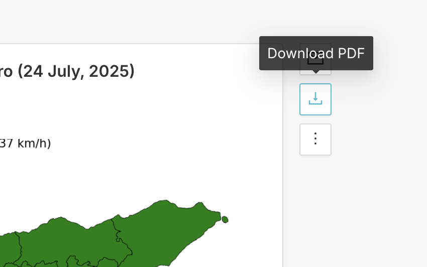{#fig-bulletin-save-pdf fig-align="center"}

Chart integration represents a particularly advanced feature where the system can automatically embed Superset charts into bulletins with dynamically generated thumbnails using chart slug URLs (e.g., ResponsiveChartSlug components), ensuring that visual data presentations are always current and properly formatted for the intended communication medium. The system maintains chart version control through slug-based references and implements responsive chart containers that adapt to different display contexts. The system also supports automated bulletin generation based on alert triggers, enabling rapid response communications during health emergencies.

### 3.2 Public Education Module

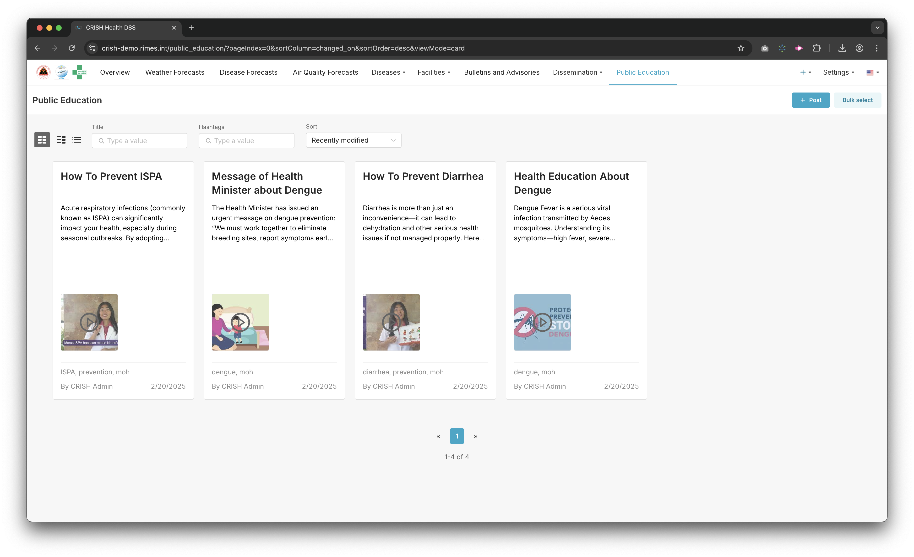{#fig-public-education-module fig-align="center"}

The Public Education Module provides a multi-media content management system with YouTube integration and multi-language support specifically designed for health education and public awareness campaigns within the CRISH platform. The system manages educational content across multiple media types including text articles, video content, infographics, and interactive educational materials.

The YouTube video embedding support allows health authorities to integrate video-based educational content directly into the platform, with automatic thumbnail generation and metadata management. The system maintains organized categorization of educational content by topic (disease prevention, environmental health, emergency preparedness), target audience (general public, health professionals, community leaders), and language preferences.

Multi-language content support ensures that educational materials can be delivered in Portuguese, Tetum, and English, with automated content synchronization across language versions. The system includes analytics capabilities that track content engagement and effectiveness, helping health authorities understand which educational approaches are most successful in reaching and informing their target audiences.


## 4. Advanced Dissemination System

### 4.1 Multi-Channel Dissemination

The Advanced Dissemination System provides a 4-channel communication platform (email, Facebook, WhatsApp, mobile app) with a manual form-based workflow designed to enable controlled and targeted distribution of health information, alerts, and bulletins across Timor-Leste's diverse communication landscape. The system implements integrated SMTP email services, WhatsApp Business API with template-based messaging, Facebook Graph API with unpublished photo upload capabilities, and mobile app broadcast webhooks with JSON payload transmission. The system provides a unified communication management interface capable of coordinating simultaneous message delivery across multiple platforms through user-initiated actions.

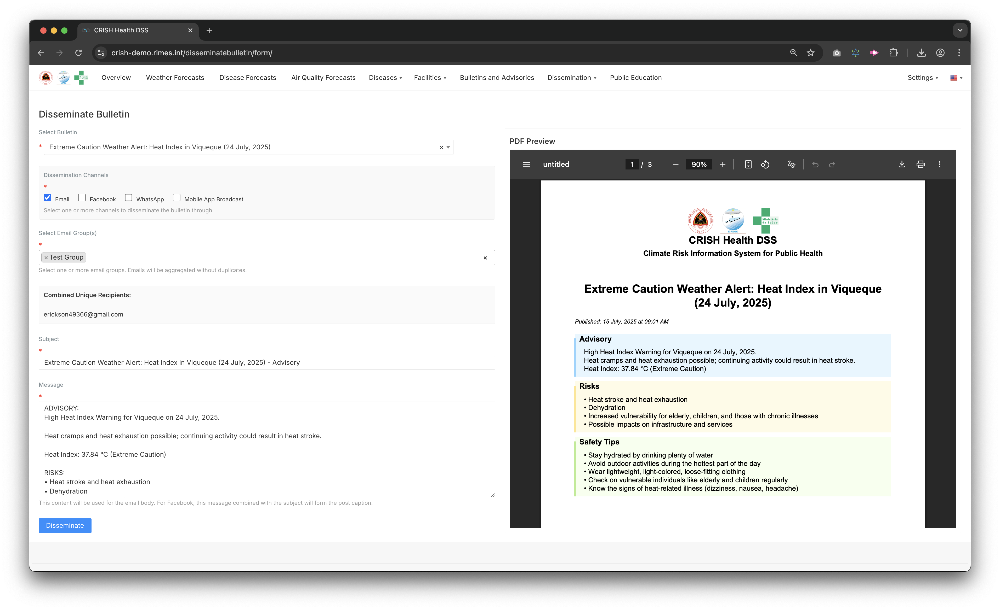{#fig-multi-channel-dissemination fig-align="center"}

The system supports four primary communication channels: email distribution lists for formal communications with health professionals and government officials; WhatsApp group messaging for rapid informal communication with community health workers and local leaders; Facebook page posting for broad public awareness campaigns; and mobile app bulletin distribution through webhook notifications and PDF generation systems.

The multi-channel approach ensures message redundancy and maximum reach, with user-controlled channel selection based on message type, urgency level, and target audience characteristics. The system maintains detailed delivery tracking with DisseminatedBulletinLog database entries and analytics, providing real-time feedback on message delivery success rates and audience engagement across all channels.

The manual bulletin dissemination process requires authorized users to access the dissemination interface at `/disseminatebulletin/form/`, where they select the bulletin to distribute, choose target communication channels, specify recipient groups (email groups, WhatsApp groups), customize message content, and manually trigger the distribution process. This user-controlled approach ensures appropriate review and authorization of all communications while maintaining comprehensive audit logging through DisseminatedBulletinLog entries that track success/failure rates across all channels, providing accountability and oversight for critical health information distribution.

{#fig-email-dissemination-sample fig-align="center"}

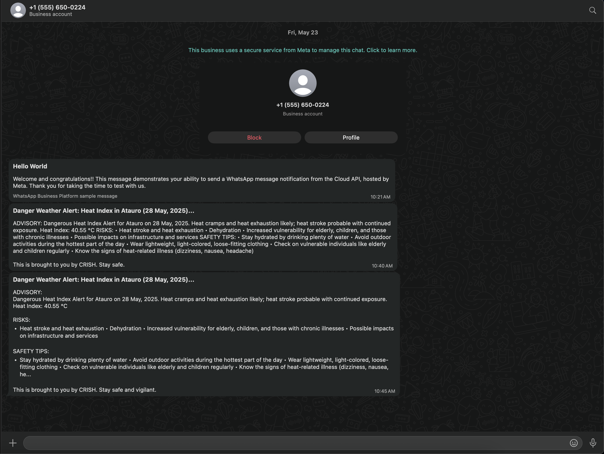{#fig-whatsapp-dissemination-sample fig-align="center"}

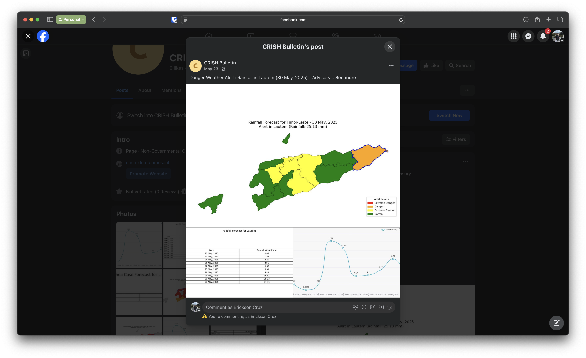{#fig-facebook-dissemination-sample fig-align="center"}


### 4.2 Communication Management

The Communication Management system provides CRUD-based administrative interfaces with SQLAlchemy relationship management for managing all aspects of the multi-channel dissemination infrastructure. The email group management interface offers complete CRUD (Create, Read, Update, Delete) operations for maintaining distribution lists, with SQLAlchemy many-to-many relationship management that allows for targeted communications based on recipient roles, geographic locations, and organizational affiliations. The system implements email deduplication using Python sets and comma-separated string parsing for efficient recipient list processing.

WhatsApp group integration leverages the WhatsApp Business API to enable automated messaging to predefined groups while maintaining compliance with platform policies and ensuring message delivery reliability. The system includes message template management, delivery confirmation tracking, and automatic retry mechanisms for failed deliveries.

Facebook integration provides automated posting capabilities with support for both text and image content, allowing for immediate public dissemination of health advisories and educational materials. The system includes automatic image optimization and social media-appropriate formatting to ensure maximum engagement and readability on the Facebook platform. The integration also supports analytics tracking to measure post reach, engagement, and effectiveness of social media-based health communications.

## 5. Health Facilities Management

### 5.1 Enhanced Facilities Module

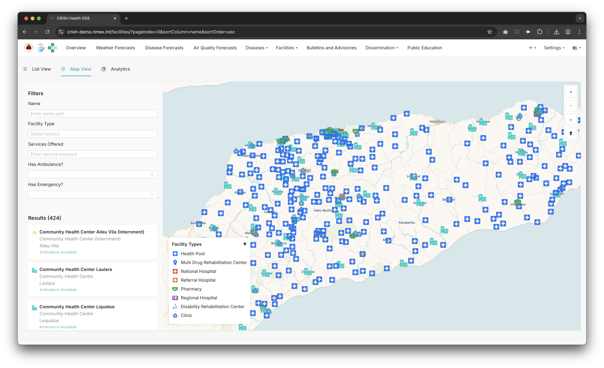{#fig-facilities-module fig-align="center"}

The Enhanced Facilities Module provides an 11-endpoint geospatial platform with haversine distance calculations for managing and visualizing health facility information across Timor-Leste through an integrated web-based interface. The module features an interactive map view using DeckGL that displays all health facilities as georeferenced markers with custom facility type icons, enabling health authorities to quickly understand the geographic distribution of health services and identify potential coverage gaps or service accessibility issues.

The facility type categorization module employs custom SVG icons and color coding to distinguish between different facility types including hospitals, health centers, community clinics, pharmacies, and specialized treatment facilities. This visual differentiation enables rapid assessment of service availability and helps in resource allocation planning and emergency response coordination. The module includes facility types such as "National Hospital", "Regional Hospital", "Referral Hospital", "Community Health Center", "Health Post", "Clinic", "Pharmacy", and various rehabilitation centers.

The analytics dashboard provides multi-metric statistical analysis across the facility database including service capacity metrics, patient volume trends, resource utilization rates, and geographic coverage analysis. The dashboard includes interactive visualizations using Recharts (pie charts, bar charts) that allow users to filter and analyze data by facility type, geographic region, service categories, and operational characteristics like ambulance availability and emergency services.

The improved facility update interface supports both individual facility record management and bulk update operations through Excel-based data import capabilities. The module includes data validation and verification processes to ensure data quality and consistency across the facility database. The interface supports workflow management for facility information updates, including approval processes and audit trail maintenance through created_by and changed_on tracking fields.

### 5.2 Facilities Data Management

The Facilities Data Management module provides SQLAlchemy ORM backend infrastructure for maintaining detailed health facility information across Timor-Leste. The module is built around a SQLAlchemy ORM data model that captures 21 distinct facility characteristics including basic identification information (key, name, facility_type, code), geographic coordinates using standard latitude/longitude Float columns, four-tier administrative hierarchy (municipality, location/administrative post, suco, aldeia), and operational metadata with automated audit trail maintenance. The module implements Haversine distance calculations for proximity-based queries and supports complex geospatial filtering using latitude/longitude bounding box operations.

The Excel-based bulk update system supports multi-sheet processing across 14 predefined administrative posts (Aileu, Ainaro, Atauro, Baucau, Bobonaro, Covalima, Dili, Ermera, Manatuto, Manufahi, Lautem, Liquica, Raeoa, Viqueque) with comprehensive data validation including coordinate validation, numeric type conversion for bed counts and elevation data, and automatic facility key generation using "No + Administrative Post" concatenation. The system implements upsert operations that update existing facilities based on unique keys while adding new records for previously unknown facilities.

{#fig-facilities-bulk-update fig-align="center"}

Data validation and processing include automated error handling with per-row exception logging, required field validation for facility names and coordinates, pandas-based data type conversion for numeric columns (Longitude, Latitude, Elevation, Ambulance, Maternity bed, Total bed), and automatic boolean conversion for ambulance availability. The system maintains complete processing logs and provides template download functionality for consistent data formatting across updates.

Service type classification provides a structured approach for categorizing health services available at each facility, enabling complex SQL aggregation queries with GROUP BY operations and statistical analysis functions (func.count) for service availability and accessibility across different geographic regions. The module supports ILIKE pattern matching for case-insensitive service searches across 8 searchable fields: name, facility_type, code, location, municipality, suco, aldeia, and services. The classification system supports facility categorization across multiple administrative levels with proper hierarchical relationships between municipality, administrative post, suco, and aldeia geographic divisions.

Contact information management maintains basic communication details for each facility including address, phone, and email contact information with optional field handling for missing data. The module includes automated validation of contact information and supports potential future integration with communication systems for targeted outreach. Operational information includes facility capacity details (total_beds, maternity_beds), service availability flags (has_ambulance, has_emergency automatically derived from facility type), and operational schedules (operating_days, operating_hours).

## 6. Advanced Visualization Components

### 6.1 Enhanced DeckGL Visualizations

The Enhanced DeckGL Visualizations represent a multi-layered geospatial visualization framework built on DeckGL React components with OpenStreetMap tile layer integration, specifically designed to support the complex mapping and spatial analysis requirements of the CRISH health information system. The system implements multiple layer composition including ScatterplotLayer, GeoJsonLayer, IconLayer, and TileLayer components with real-time viewport state management using LinearInterpolator for smooth transitions. The system leverages the DeckGL library with OpenStreetMap integration to provide high-performance, interactive visualizations capable of handling large datasets while maintaining smooth user interactions and visual clarity.

The multi-layer visualization support enables simultaneous display of multiple data types on a single map interface, allowing users to overlay disease occurrence data, weather patterns, health facility locations, and administrative boundaries. This multi-layer approach provides integrated situational awareness by enabling health authorities to visualize the relationships between different data types and identify patterns that might not be apparent when viewing data in isolation.

The feed layer implementation provides real-time data streaming capabilities, enabling live updates of visualization content as new data becomes available from disease surveillance systems, weather monitoring networks, or other data sources. This real-time capability ensures that health authorities always have access to the most current information when making critical decisions.

Time-series animation controls allow users to visualize how patterns change over time, providing insights into disease progression, seasonal patterns, and the effectiveness of intervention strategies. The animation system includes React state-based playback controls with Ant Design DatePicker components, speed adjustment capabilities using configurable interval timers, and bookmark functionality implemented through URL query parameter persistence for saving and sharing specific temporal views.

Interactive tooltips and legends provide contextual information and data exploration capabilities, allowing users to drill down into specific data points while maintaining the overall visualization context. The tooltip system includes dynamic content generation that adapts based on the data types and layers currently displayed.

### 6.2 Chart Management Enhancements

The Chart Management Enhancements provide an 11-endpoint framework with slug-based routing, thumbnail generation, and cache management for creating, managing, and sharing data visualizations across the CRISH platform. The chart slug system implements human-readable URL identifiers that facilitate easy embedding of charts in bulletins, reports, and external communications while maintaining version control and access management.

Responsive chart containers ensure optimal visualization display across different devices and screen sizes, automatically adapting chart layouts and interactive elements to provide the best possible user experience whether accessed from desktop computers, tablets, or mobile devices. The responsive system includes intelligent font scaling, axis adjustment, and interactive element positioning to maintain chart readability and functionality across all platform types.

Thumbnail generation for bulletin integration represents an automated system that creates publication-ready chart previews using responsive chart containers and dynamic image generation for inclusion in health bulletins and reports. The system implements automatic chart slug resolution, responsive container sizing with CSS media queries, and image optimization for different bulletin formats. The thumbnail system maintains visual consistency while ensuring that chart content remains legible and meaningful when reduced to smaller sizes required for document layouts.

Enhanced chart sharing capabilities include secure link generation, permission management, and export functionality that supports multiple output formats including high-resolution images, PDF documents, and interactive web embeds. The sharing system maintains audit trails of chart access and includes time-based expiration controls for sensitive health information.

## 7. Internationalization and Multi-Language Support

### 7.1 Comprehensive Multi-Language Architecture

The CRISH platform implements a robust internationalization (i18n) system that supports three languages specifically tailored for Timor-Leste's linguistic landscape: English, Portuguese (Timor-Leste variant), and Tetum. The system employs a dual-framework approach using Flask-Babel for backend translations and React i18n integration for frontend components, ensuring comprehensive language coverage across all user interface elements and system communications.

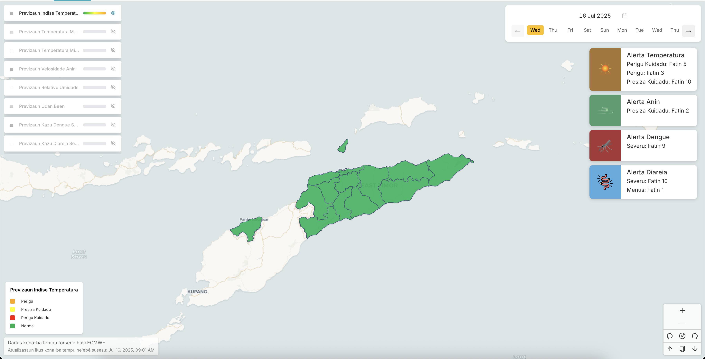{#fig-tetum-translated-overview fig-align="center"}

The language configuration is implemented through a structured language mapping system defined in the Docker configuration:

```python
LANGUAGES = {
    "en": {"flag": "us", "name": "English"},
    "pt_TL": {"flag": "pt", "name": "Timorese Portuguese"},
    "id": {"flag": "tl", "name": "Tetum"},
}
```

**Strategic Language Implementation:**

- **English (en)**: Default system language providing international accessibility
- **Portuguese Timor-Leste (pt_TL)**: Custom variant addressing Portuguese language needs specific to Timor-Leste context
- **Tetum (id)**: Use of Indonesian language code due to absence of official Tetum ISO code, with Timor-Leste flag representation

The system architecture leverages Flask-AppBuilder's built-in internationalization capabilities while extending support for specialized regional languages that are critical for effective health communication in Timor-Leste.

### 7.2 Translation Management Infrastructure

The translation infrastructure employs a sophisticated build and deployment pipeline using Babel extraction tools and automated translation compilation. The system manages translation files through a hierarchical directory structure (`superset/translations/`) with separate folders for each supported language containing LC_MESSAGES directories with .po source files, .mo binary files for backend consumption, and .json files optimized for frontend JavaScript consumption.

**Translation File Organization:**

```
superset/translations/
├── en/LC_MESSAGES/          # English (default/fallback)
├── pt_TL/LC_MESSAGES/       # Portuguese Timor-Leste
│   ├── messages.po          # Source translation file
│   ├── messages.mo          # Compiled binary for backend
│   └── messages.json        # Frontend JSON format
└── id/LC_MESSAGES/          # Tetum (using Indonesian code)
    ├── messages.po
    ├── messages.mo
    └── messages.json
```

The translation management system includes automated build scripts that handle:

- **Babel Extraction** (`babel_update.sh`): Automated string extraction from Python and JavaScript source files
- **Translation Compilation** (`generate_mo_files.sh`): Binary file generation for backend consumption
- **JSON Generation** (`po2json.sh`): Frontend-optimized translation file creation
- **Build Integration**: Docker build process with conditional translation compilation

**Translation Statistics:**

The current translation coverage demonstrates significant localization effort:

- **Portuguese (pt_TL)**: 14,959 translation entries with comprehensive coverage across health terminology
- **Indonesian/Tetum (id)**: 11,599 translation entries adapted for Tetum linguistic patterns
- **English**: 3,987 baseline entries serving as translation source

### 7.3 Frontend Internationalization Framework

The frontend internationalization system integrates seamlessly with React components using the @superset-ui/core translation framework. The system provides runtime language switching capabilities through a language picker component that maintains user preferences and ensures consistent language context across all interface elements including navigation menus, form labels, error messages, chart legends, and help documentation.

**Frontend Translation Architecture:**

```typescript
// Supported locale types
export type Locale =
  | 'en'      // English (default)
  | 'pt_TL'   // Portuguese Timor-Leste
  | 'id'      // Tetum (using Indonesian code)
  | ... // other supported locales
```

The frontend system employs several key components:

- **Translation Functions**: `t()` for simple string translation and `tn()` for pluralization-aware translations
- **Language Pack Loading**: Dynamic loading of JSON translation files based on user language selection
- **Context Preservation**: Maintains language selection across page navigation and user sessions
- **Responsive Design**: Language-aware text formatting and right-to-left text support
- **Cultural Adaptation**: Date/time formatting appropriate for regional context

### 7.4 Language-Aware Content Management

The multi-language system extends beyond interface translations to encompass content localization across all major platform components. This includes health terminology standardization, disease classification translations, weather parameter descriptions, and safety recommendation messaging that are culturally and linguistically appropriate for each target language.

**Content Localization Features:**

- **Health Terminology**: Standardized medical terminology translations ensuring consistency across disease surveillance, weather alerts, and health advisories
- **Safety Messaging**: Language-specific safety recommendations that consider cultural context and communication patterns
- **Geographic References**: Localized municipality names, administrative divisions, and geographic feature descriptions
- **Alert Classifications**: Culturally appropriate severity level descriptions and response guidelines
- **Dashboard Labels**: Comprehensive translation of chart titles, axis labels, legend entries, and interactive elements

**Dynamic Language Switching:**

The system implements real-time language switching without requiring page reloads, using React state management to immediately update all visible text elements. The language picker component provides flag-based visual identification for each supported language and maintains user preferences through browser storage and user profile settings.

### 7.5 Cultural and Regional Adaptation

Beyond direct translation, the internationalization system incorporates cultural adaptation elements that ensure effective communication across Timor-Leste's diverse linguistic landscape. This includes consideration of formal versus informal communication styles, technical terminology accessibility, and culturally appropriate health messaging frameworks.

**Regional Customization:**

- **Date/Time Formatting**: Localized date formats and time zone handling appropriate for Timor-Leste
- **Number Formatting**: Cultural number representation and decimal notation preferences
- **Address Formats**: Local administrative hierarchy representation and geographic naming conventions
- **Color Coding**: Culturally sensitive color choices for alert levels and data visualization

The system also supports mixed-language content scenarios where technical terms may be retained in English while explanatory text is provided in local languages, addressing the reality of health sector communication where international terminology coexists with local language descriptions.

## 8. User Management and Security

### 8.1 Custom Authentication System

The Custom Authentication System extends Superset's Flask-AppBuilder SecurityManager with health sector-specific enhancements designed for Timor-Leste's multi-institutional environment. The system implements standard Superset role-based access control (Admin, Alpha, Gamma, SQL_Lab roles) with custom extensions, row-level security filters with database-level permission enforcement, and comprehensive audit trail capabilities for user activity tracking.

#### Enhanced User Registration and Profile Management

The system extends the standard user model to capture critical health sector-specific information including professional positions, contact details, demographic data, and accessibility considerations. This detailed user profiling enables multi-level permission hierarchy enforcement with datasource, database, and schema-level access controls, ensuring that users only access information appropriate to their roles and responsibilities.

The registration process includes comprehensive data collection through a structured form that captures:

- **Professional Information**: Position titles and organizational affiliations
- **Contact Details**: Phone numbers and email addresses for communication
- **Demographic Data**: Gender preferences and age categories for reporting
- **Accessibility Support**: Disability status and accommodation types for inclusive access

#### User Registration Workflow

The system provides user registration capabilities built on Flask-AppBuilder's user management framework, with health sector-specific field extensions for organizational data collection. The registration system supports both self-registration and administrative user creation workflows.

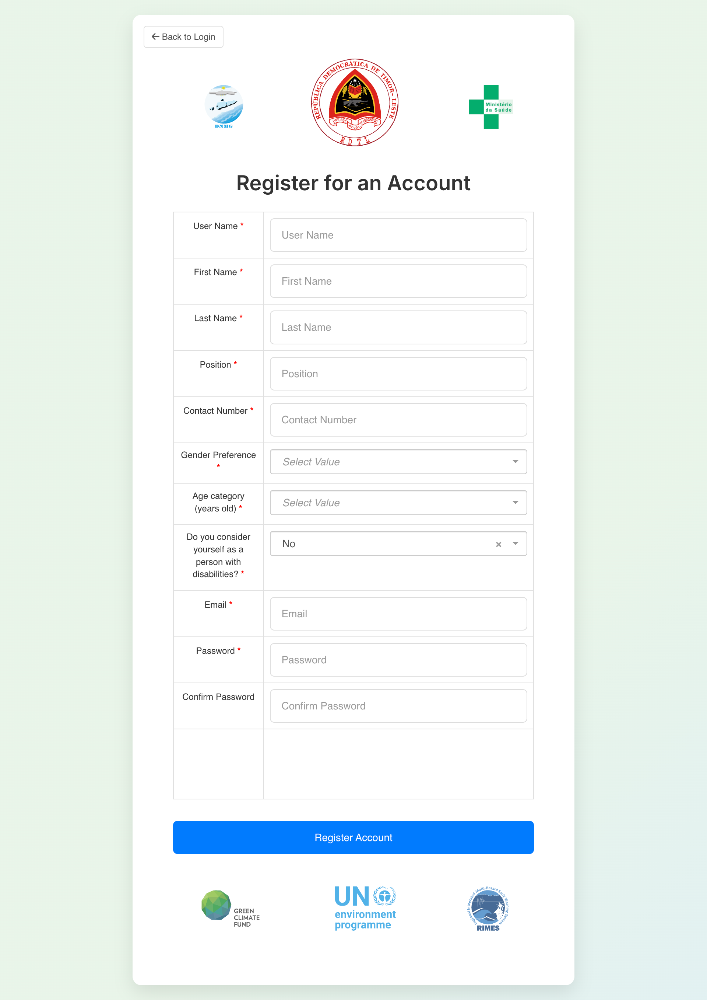{#fig-register-form-interface fig-align="center"}

**Registration System Features:**

- **Extended User Profile Fields**: Additional fields for health sector professional information
- **Form Validation**: Client-side and server-side validation for data integrity
- **Role Assignment**: Administrative role assignment based on organizational policies
- **Integration with Audit System**: User creation tracking through Flask-AppBuilder audit capabilities


#### Branded Authentication Interface

The authentication interface incorporates organizational branding appropriate for Timor-Leste's health sector, featuring government logos, institutional colors, and culturally appropriate visual elements that establish system credibility and professional appearance. The login interface includes:

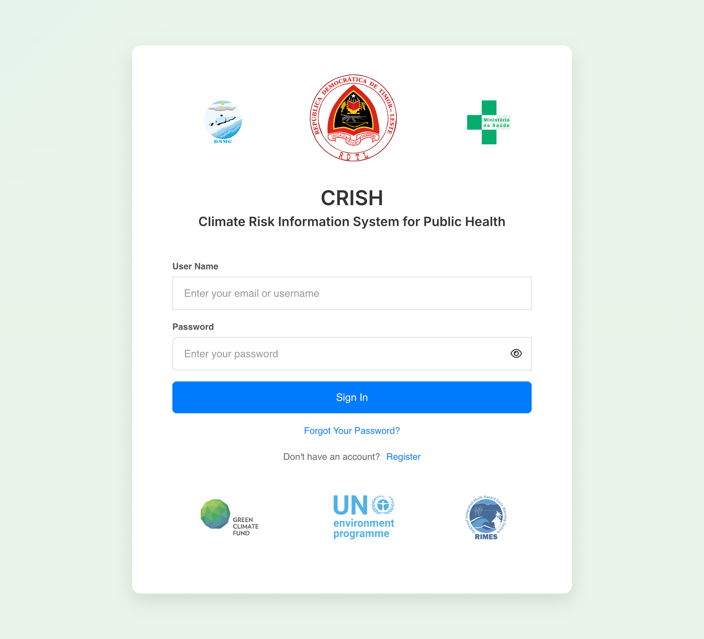{#fig-login-form-interface fig-align="center"}

- **Institutional Branding**: Ministry of Health, RDTL, and DNMG logos prominently displayed
- **Partner Recognition**: Green Climate Fund, UNEP, and RIMES organizational acknowledgments
- **Professional Design**: Clean, responsive interface with animated gradients and modern styling
- **Accessibility Features**: Password visibility toggles, clear navigation, and mobile-responsive design

#### Authentication Methods and Security Features

**Implemented Authentication Methods:**

- **Database Authentication**: Primary authentication method using PostgreSQL user storage
- **OAuth Support**: Framework support available through Flask-AppBuilder (requires configuration)
- **LDAP Integration**: Framework capability available but not fully configured in current deployment

**Security Features:**

- **Secure Password Management**: Encrypted storage with strength validation and reset capabilities
- **Token-Based Verification**: Time-limited, tamper-resistant tokens for email verification and password resets
- **Session Security**: Automatic session management with configurable timeouts
- **CSRF Protection**: Comprehensive form protection across all authentication workflows
- **Audit Trail**: User activity logging through Flask-AppBuilder's built-in audit capabilities

#### Password Recovery and Reset System

The system implements a comprehensive password recovery mechanism that provides secure, user-friendly password reset capabilities while maintaining the highest security standards. The password recovery workflow consists of two main components: a forgot password request interface and a secure password reset confirmation system.

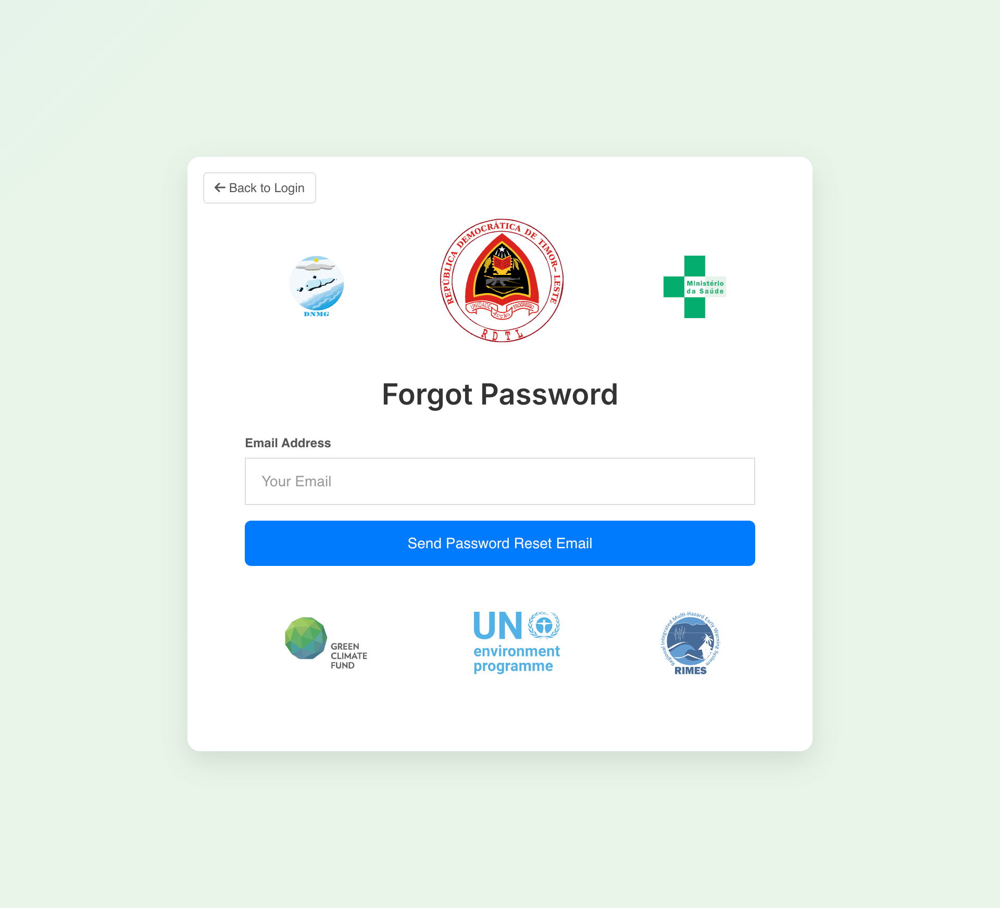{#fig-forgot-password-interface fig-align="center"}

**Forgot Password Request Process:**

The forgot password system begins with a simple, accessible interface that requires only the user's email address. The system implements email enumeration protection by providing consistent feedback messages regardless of whether the submitted email exists in the system, preventing malicious users from discovering valid email addresses through trial and error.

The request process features:

- **Single Email Field Interface**: Streamlined form requiring only email address input
- **Enumeration Protection**: Consistent success messaging regardless of email validity
- **Email Validation**: Client-side and server-side email format verification
- **Rate Limiting**: Protection against automated abuse and spam requests

**Secure Token Generation and Validation:**

The password reset system employs advanced cryptographic techniques to ensure maximum security throughout the reset process. Token generation includes multiple security layers:

- **Time-Limited Tokens**: One-hour expiration window to minimize security exposure
- **Password Stamping**: Tokens include cryptographic stamps from the current password hash, automatically invalidating tokens if the password is changed through other means
- **User Verification**: Multi-point validation including user ID, email address, and password state verification
- **Tamper Detection**: Cryptographic signatures that detect any token modification attempts

{#fig-sample-reset-password-email fig-align="center"}

**Email Notification System:**

The password reset email system integrates with the broader CRISH communication infrastructure to provide reliable, professional password reset notifications. The email system includes:

- **SMTP Integration**: Robust email delivery using configurable SMTP settings
- **HTML Email Templates**: Professional, branded email messages with clear instructions
- **Delivery Confirmation**: Comprehensive logging of email delivery attempts and results
- **Fallback Mechanisms**: Error handling and retry logic for failed email deliveries

**Reset Confirmation Interface:**

The password reset confirmation interface provides a secure, user-friendly method for users to establish new passwords. The interface maintains the same CRISH branding and professional appearance as other authentication components while implementing comprehensive security measures.

Key features include:

- **Token Validation**: Real-time verification of reset tokens before displaying the form
- **Password Strength Requirements**: Client-side and server-side password complexity validation
- **Confirmation Fields**: Dual password entry with real-time matching verification
- **Secure Form Handling**: CSRF protection and secure form submission protocols
- **Automatic Login Redirection**: Seamless transition back to the login interface upon successful reset

**Security Architecture and Protection Mechanisms:**

The password recovery system implements multiple layers of security protection designed to prevent common attack vectors:

- **Replay Attack Prevention**: Single-use tokens that become invalid after successful password reset
- **Timing Attack Mitigation**: Consistent response times regardless of email validity
- **Brute Force Protection**: Rate limiting and account lockout mechanisms for repeated failed attempts
- **Session Security**: Secure token transmission and storage with automatic cleanup
- **Audit Trail Maintenance**: Comprehensive logging of all password reset activities for security monitoring

This sophisticated password recovery system ensures that users can regain access to their accounts through a secure, reliable process while maintaining the integrity and security of the overall authentication framework within the CRISH health information system.

#### Role-Based Access Control

The system implements Superset's standard four-tier role hierarchy with health sector customizations:

- **Admin Role**: Full system access including user management, role assignment, and system configuration
- **Alpha Role**: Advanced analytical capabilities with dashboard and chart creation permissions
- **Gamma Role**: Standard user access for viewing dashboards and basic data interaction
- **SQL Lab Role**: Database query permissions for technical users

**Implemented Access Controls:**

- Database and schema-level permissions through Superset's native permission system
- Row-level security (RLS) filters for municipality-specific data access
- Custom security manager extensions in `docker/pythonpath_dev/custom_auth/`

# Challenges and Current Limitations

During the development and implementation of the CRISH platform, several significant challenges have been encountered that affect the system's current operational capabilities and data integration workflows. These challenges primarily relate to external data source availability and the resulting need for alternative data acquisition strategies.

## Data Integration Challenges

### TLHIS System Integration Limitations

The integration with Timor-Leste's Health Information System (TLHIS2) presents significant operational challenges that directly impact the disease surveillance and forecasting capabilities of the CRISH platform. The primary issue is the **unavailability of the TLHIS2 API**, which was originally planned to serve as the primary source for real-time disease case report data across all municipalities in Timor-Leste.

**Current Limitations:**

- **API Unavailability**: The TLHIS2 API endpoints are not currently accessible or operational, preventing automated data synchronization between the national health information system and the CRISH platform
- **Manual Data Upload Requirement**: Without API access, the system relies on **manual uploading of disease case reports in Excel (XLSX) format** on a per-municipality, per-week basis
- **Data Quality Concerns**: The manual upload process introduces potential for **dirty data ingestion**, including formatting inconsistencies, data entry errors, missing values, and temporal misalignments across different municipalities
- **Operational Burden**: Health officials must manually export data from TLHIS2, format it according to CRISH requirements, and upload it through the web interface, creating additional workload and potential delays in data availability
- **Data Timeliness Issues**: Manual processes result in delayed data availability, potentially affecting the accuracy and timeliness of disease forecasts and alert generation

**Workaround Implementation:**

To address these limitations, the CRISH platform has implemented a robust **bulk data upload interface** that supports Excel-based data ingestion with comprehensive validation and error handling capabilities. The system includes automated data cleaning procedures, duplicate detection mechanisms, and quality assurance workflows to minimize the impact of manual data entry errors.

### Air Quality Monitoring Data Limitations

The air quality monitoring component of the CRISH platform faces similar challenges related to external data source availability, specifically with the United Nations Environment Programme (UNEP) air quality monitoring infrastructure.

**Current Limitations:**

- **UNEP API Unavailability**: The **UNEP air quality monitoring API is not yet available** for Timor-Leste, preventing access to real-time air quality measurements across the country
- **Mock Data Implementation**: The system currently operates using **mock air quality data** generated according to realistic patterns and thresholds, but lacking actual environmental measurements
- **Limited Validation Capability**: Without real air quality data, the correlation analysis between air quality conditions and respiratory health outcomes cannot be fully validated or optimized
- **Reduced Predictive Accuracy**: The absence of actual air quality measurements limits the system's ability to provide accurate health advisories related to air pollution and respiratory risks

**Workaround Implementation:**

The platform includes a comprehensive **mock data generation system** that simulates realistic air quality patterns based on regional environmental studies and WHO air quality guidelines. The mock data includes multiple pollutant measurements (PM2.5, PM10, NO2, O3) with realistic temporal and geographic variations, enabling system testing and user interface development while awaiting actual data availability.

## Impact on System Operations

These data integration challenges have several implications for the current operational capacity of the CRISH platform:

**Immediate Operational Impacts:**

- **Increased Manual Workload**: Health officials must dedicate significant time to manual data preparation and upload processes
- **Potential Data Gaps**: Manual processes may result in incomplete or delayed data updates, affecting forecast accuracy
- **Limited Real-Time Capabilities**: The absence of automated data feeds reduces the system's ability to provide truly real-time alerts and notifications
- **Quality Assurance Overhead**: Additional resources are required for data validation and quality control due to manual input processes

**Long-Term Strategic Considerations:**

- **Scalability Concerns**: Manual data processes may not be sustainable as the system expands to cover additional health parameters or geographic regions
- **Data Consistency Challenges**: Different manual data entry practices across municipalities may lead to inconsistencies in data format and quality
- **Technology Integration Dependencies**: The platform's full potential depends on resolving external API availability and establishing reliable automated data feeds

## Mitigation Strategies and Future Plans

To address these challenges, several mitigation strategies and future development plans have been established:

**Short-Term Solutions:**

- **Enhanced Data Validation**: Strengthened validation algorithms and quality control procedures for manually uploaded data
- **User Training Programs**: Comprehensive training for health officials on proper data formatting and upload procedures
- **Template Standardization**: Standardized Excel templates and data entry guidelines to minimize formatting inconsistencies
- **Automated Quality Checks**: Real-time data quality assessment and feedback during the upload process

**Long-Term Strategic Plans:**

- **API Development Collaboration**: Ongoing collaboration with TLHIS2 system administrators to develop and deploy API endpoints for automated data integration
- **UNEP Partnership Expansion**: Active engagement with UNEP technical teams to expedite air quality monitoring API availability for Timor-Leste
- **Alternative Data Sources**: Investigation of alternative data sources and partnerships for both disease surveillance and air quality monitoring
- **System Architecture Flexibility**: Maintaining system architecture flexibility to accommodate multiple data sources and integration methods

These challenges, while significant, do not prevent the CRISH platform from providing valuable health information services to Timor-Leste's health sector. The implemented workarounds ensure continued operation while efforts to resolve external data source limitations continue through collaborative partnerships and technical development initiatives.
